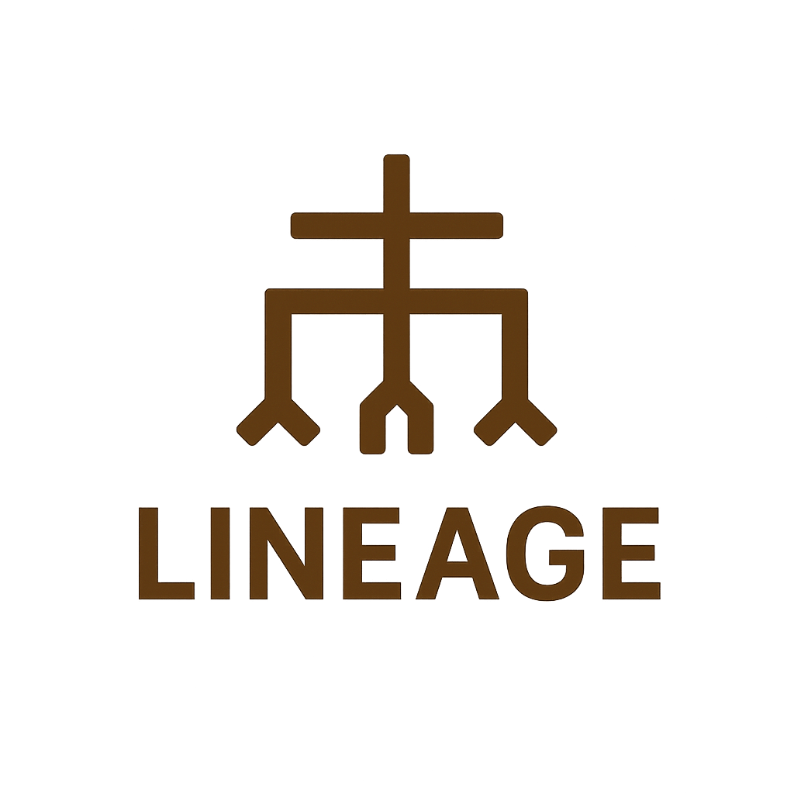

# Lineage Brand Assets

This document describes the brand assets available in `assets/` directory and provides usage guidelines for maintaining consistent branding across the Lineage project.

## Available Assets

### Banner Image
- **File**: `lineage_banner.png`
- **Usage**: README headers, documentation covers
- **Description**: Full banner with Lineage logo and tagline "Policy Governance via Nix"
- **Recommended width**: 70%–90% in README files

### Logo Variations

#### Transparent Logos
- **File**: `lineage_logo_transparent.png`
- **Usage**: Light backgrounds, overlays, presentations
- **Description**: Logo with transparent background (monochrome)

- **File**: `lineage_logo_transparent_color.png`
- **Usage**: Marketing materials, websites, documentation
- **Description**: Full-color logo with transparent background

#### Standard Logo Sizes
- `lineage_logo_small_128.png` (128x128)
- `lineage_logo_medium_256.png` (256x256)
- `lineage_logo_large_512.png` (512x512)
- `lineage_logo_xlarge_1024.png` (1024x1024)

**Usage**: Favicons, app icons, social media profiles

#### Icons
- **File**: `lineage_icon_transparent.png`
- **Usage**: Application icons, favicons
- **Description**: Simplified icon version with transparent background

### Preview and Reference
- **File**: `lineage_assets_preview.png`
- **Description**: Overview of all available brand assets

- **File**: `lineage_logo_asset_set.png`
- **Description**: Complete logo asset set preview

- **File**: `lineage_ascii.txt`
- **Description**: ASCII art version of the Lineage logo for terminal output

## Usage Guidelines

### README Headers
```markdown
<p align="center">
  
</p>
```

### Documentation
For documentation that needs a logo, use the transparent color version:
```markdown

```

### Terminal Output
For CLI applications and terminal-based tools, use the ASCII art:
```bash
cat assets/lineage_ascii.txt
```

## Brand Colors

The Lineage brand uses a distinctive color palette centered around the logo's gradient design. When creating new materials, refer to the color logo assets to maintain visual consistency.

## File Organization

All brand assets are located in the `assets/` directory at the root of the lineage-baseline repository. This ensures:
- Easy access for all consumers
- Centralized version control
- Consistent references across documentation

## Updates and Contributions

When updating brand assets:
1. Place new assets in the `assets/` directory
2. Update this BRANDING.md file with descriptions
3. Maintain backward compatibility with existing asset names
4. Test asset rendering in README files before committing

## License

All Lineage brand assets are part of the lineage-baseline repository and follow the same license terms.
