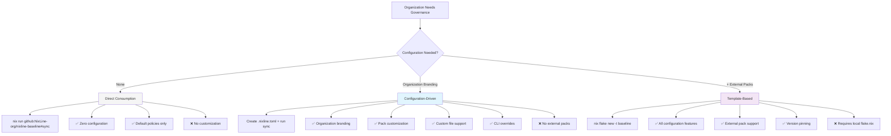
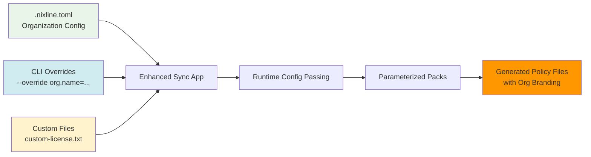
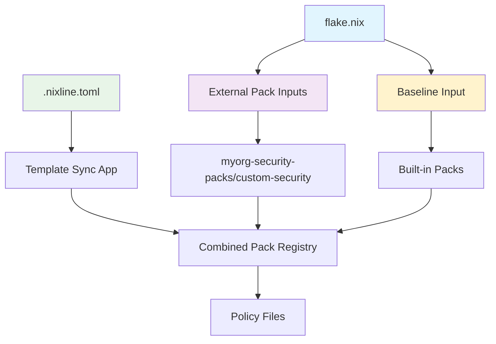
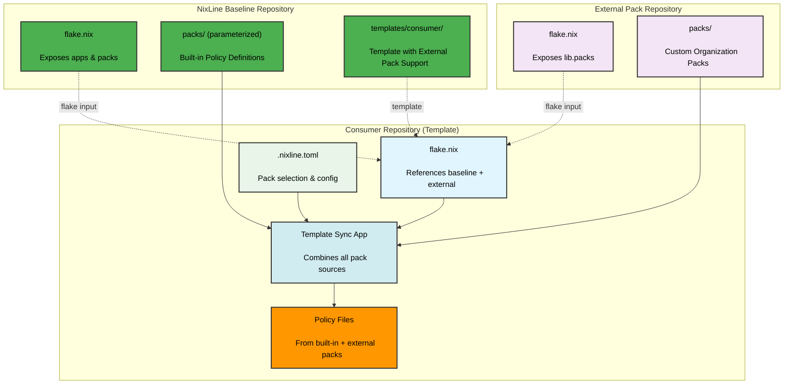
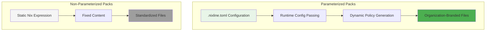
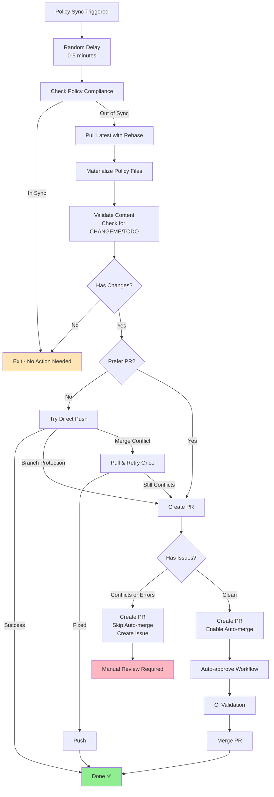

# NixLine Baseline

The **NixLine Baseline** defines the foundational Nix expressions and policies used by all repositories in the [NixLine-org](https://github.com/NixLine-org) organization.
It provides the shared Nix logic, governance rules and automation logic that all NixLine consumer repositories rely on.

## Table of Contents

- [What is NixLine?](#what-is-nixline)
  - [Key Benefits](#key-benefits)
  - [Why NixLine?](#why-nixline)
- [Consumption Patterns](#consumption-patterns)
- [Purpose](#purpose)
- [Architecture](#architecture)
- [Usage](#usage)
  - [Baseline Apps](#baseline-apps)
  - [Quick Start for Consumer Repos](#quick-start-for-consumer-repos)
- [Policy Packs](#policy-packs)
  - [Organization Script Packs](#organization-script-packs)
- [Configuration File Reference](#configuration-file-reference)
- [Governance Migration](#governance-migration)
  - [Complete Governance Migration](#complete-governance-migration)
  - [Migration Architecture](#migration-architecture)
  - [GitHub Actions Governance Migration](#github-actions-governance-migration)
  - [Import Individual Policy Files](#import-individual-policy-files)
  - [Fetch License from SPDX](#fetch-license-from-spdx)
  - [Testing Governance Migration](#testing-governance-migration)
  - [Demo Repository](#demo-repository)
- [Understanding Pack Propagation](#understanding-pack-propagation)
- [Recommended Implementation](#recommended-implementation)
- [Customization Checklist](#customization-checklist)
- [Tagging Policy](#tagging-policy)
- [NixLine vs Traditional Policy Distribution](#nixline-vs-traditional-policy-distribution)
- [Importance of the Baseline](#importance-of-the-baseline)

---

## What is NixLine?

**NixLine** provides organization-wide CI governance and policy enforcement through Nix flakes with **configuration-driven consumption** that eliminates the need for forking or maintaining your own baseline.

### Key Benefits

- **Pure Upstream Consumption**: Use NixLine baseline directly without forking
- **Zero Maintenance Overhead**: Consume as pure upstream, receive improvements automatically
- **Configuration-Driven**: Full customization through `.nixline.toml` files and CLI overrides
- **Governance Migration**: Automatic conversion of existing governance repositories to NixLine format
- **Workflow Automation**: Pre-validated CI/CD workflows with auto-merge support
- **Script Packaging**: Automatic detection and distribution of organization-specific scripts
- **Immediate Updates**: Receive baseline improvements instantly without manual intervention
- **Custom File Support**: Override any pack with organization-specific files
- **Parameterized Packs**: Runtime configuration passing following nix.dev best practices
- **External Pack Support**: Add organization-specific packs via template pattern
- **Reproducible**: All dependencies pinned, configuration separated from logic

### Why NixLine?

**The Problem**: Organizations managing hundreds of repositories face a critical challenge - when security policies change, licenses are adopted or coding standards are updated, those changes must propagate to every repository. Traditional governance systems create individual pull requests to each repository, requiring manual review and merge. For an organization with 500 repositories, a single policy change creates 500 separate pull requests requiring human attention.

**The Solution**: NixLine eliminates the pull request bottleneck through Nix-based materialization. Policies propagate instantly through flake updates while maintaining audit trails through optional PR workflows with auto-merge. Organizations receive:

- **Instant Policy Updates**: Changes materialize immediately without PR bottlenecks
- **Governance Migration**: Convert existing governance repositories automatically
- **Automated Workflows**: Pre-built CI/CD with validation and auto-merge
- **Pure Upstream Consumption**: Zero maintenance overhead, no baseline forking required
- **Flexible Review Controls**: Direct commits for speed or PR workflows for compliance

---

## Consumption Patterns

NixLine offers three consumption patterns to match different organizational needs:



### Pattern 1: Direct Consumption (Default)

**Best for**: Quick start with default NixLine policies.

```bash
# No configuration required - uses defaults
nix run github:NixLine-org/nixline-baseline#sync
```

### Pattern 2: Configuration-Driven (Recommended)

**Best for**: Organizations wanting customization without baseline forking.

```bash
# Create configuration file, then sync
nix run github:NixLine-org/nixline-baseline#sync -- --config .nixline.toml
```

**Configuration-Driven Architecture**:


**Example Configuration**:
```toml
# .nixline.toml
[organization]
name = "MyCompany"
security_email = "security@mycompany.com"
default_team = "@MyCompany/maintainers"

[packs]
enabled = ["editorconfig", "license", "codeowners"]

[packs.license]
custom_file = "my-license.txt"

[packs.editorconfig]
indent_size = 4
line_length = 100
```

### Pattern 3: Template-Based (With External Packs)

**Best for**: Organizations needing custom packs while avoiding baseline forking.

```bash
# Initialize from template
nix flake new -t github:NixLine-org/nixline-baseline my-repo
cd my-repo

# Add external packs to flake.nix, then sync
nix run .#sync
```

**Architecture**:


---

## Purpose

NixLine uses a **hybrid architecture** with two types of governance:

### 1. Persistent Policies (Committed)
Files like `LICENSE`, `SECURITY.md`, `.editorconfig` are materialized and committed to consumer repos for visibility and GitHub integration.

### 2. Pure Nix Apps (No Files)
Apps like pack creation and policy import tools run via `nix run .#app` with no file materialization.

---

## External Pack Development

Organizations can create their own pack repositories to extend NixLine functionality:

### External Pack Repository Structure

```
myorg-nixline-packs/
├── flake.nix
├── lib/
│   └── default.nix      # Pack registry
└── packs/
    ├── golang-standards.nix
    ├── custom-security.nix
    └── compliance-audit.nix
```

### Example External Pack

```nix
# packs/golang-standards.nix
{ pkgs, lib, config ? {} }:

{
  files = {
    ".golangci.yml" = ''
      # Organization-specific Go linting rules
      linters:
        enable:
          - gofmt
          - golint
          - govet
    '';
  };

  checks = [
    {
      name = "golang-format";
      check = ''
        if [[ -f ".golangci.yml" ]]; then
          echo "✓ Go linting configuration present"
        fi
      '';
    }
  ];
}
```

### Using External Packs

1. **Add to flake inputs**:
```nix
inputs.myorg-packs.url = "github:myorg/nixline-packs";
```

2. **Reference in .nixline.toml**:
```toml
[packs]
enabled = [
  "editorconfig",
  "myorg-packs/golang-standards"
]
```

The [nixline-demo1](https://github.com/NixLine-org/nixline-demo1) demonstrates **direct consumption**, while [nixline-demo2](https://github.com/NixLine-org/nixline-demo2) shows **configuration-driven** patterns.

---

## Architecture

### Direct Consumption Pattern (Pure Upstream)


### Template Consumption Pattern (With External Packs)



### Repository Types

1. **`.github` Repository** ([NixLine-org/.github](https://github.com/NixLine-org/.github))
   - Contains reusable GitHub Actions workflows
   - Referenced via `uses: YOUR-ORG/.github/.github/workflows/nixline-ci.yml@stable`

2. **Baseline Repository** (this repo)
   - Stores Nix-based policy definitions ("packs")
   - Exposes packs as flake lib outputs
   - Provides migration tools (import-policy, fetch-license)
   - Provides consumer template via `nix flake init -t`
   - Organizations fork this to create their own governance baseline

3. **Consumer Repositories** ([nixline-demo1](https://github.com/NixLine-org/nixline-demo1))
   - Your actual projects
   - Reference baseline as a flake input
   - Run `nix run .#sync` to materialize persistent policies
   - Run utility apps for pack creation and policy import

---

## Usage

### Enhanced Sync App

The sync app now features **runtime configuration passing** following nix.dev best practices, enabling organizations to consume the baseline as pure upstream without forking.

**Basic Usage:**
```bash
# Default policies (no configuration)
nix run github:NixLine-org/nixline-baseline#sync

# Configuration-driven (organization branding)
nix run github:NixLine-org/nixline-baseline#sync -- --config .nixline.toml

# Preview changes without applying
nix run github:NixLine-org/nixline-baseline#sync -- --dry-run

# Select specific packs
nix run github:NixLine-org/nixline-baseline#sync -- --packs editorconfig,license,codeowners

# Exclude packs from defaults
nix run github:NixLine-org/nixline-baseline#sync -- --exclude security,dependabot

# CLI overrides (runtime customization)
nix run github:NixLine-org/nixline-baseline#sync -- --override org.name=MyCompany
nix run github:NixLine-org/nixline-baseline#sync -- --override org.email=security@mycompany.com

# Combine options
nix run github:NixLine-org/nixline-baseline#sync -- --config .nixline.toml --override org.name=TestCorp --dry-run
```

**Other Apps:**
```bash
# Validate policies match baseline
nix run github:NixLine-org/nixline-baseline#check

# Import existing policy files
nix run github:NixLine-org/nixline-baseline#import-policy -- --auto

# List supported license types
nix run github:NixLine-org/nixline-baseline#list-licenses

# Fetch license from SPDX
nix run github:NixLine-org/nixline-baseline#fetch-license -- Apache-2.0 --holder "ACME Corp"

# Create a new pack
nix run github:NixLine-org/nixline-baseline#create-pack flake8
```

**Template-based (after `nix flake init -t`):**
```bash
# Materialize persistent policies
nix run .#sync

# Validate policies match baseline
nix run .#check

# Additional utility apps available
nix run .#create-pack <name>
nix run .#import-policy -- --auto
nix run .#fetch-license -- Apache-2.0 --holder "My Company"
```

### Quick Start for Consumer Repos

Choose from three consumption patterns:

#### Option 1: Direct Consumption (Default Policies)

For quick start with default NixLine policies:

```bash
# Sync default policies
nix run github:NixLine-org/nixline-baseline#sync

# Verify policies are in sync
nix run github:NixLine-org/nixline-baseline#check

# Commit the materialized policy files
git add LICENSE SECURITY.md .editorconfig .github/
git commit -m "add NixLine policies"
```

**Customize packs with command line arguments:**
```bash
# Include only specific packs
nix run github:NixLine-org/nixline-baseline#sync -- --packs editorconfig,license,codeowners

# Exclude specific packs from defaults
nix run github:NixLine-org/nixline-baseline#sync -- --exclude security,dependabot

# Check only specific packs
nix run github:NixLine-org/nixline-baseline#check -- --packs editorconfig,license
```

**Or use environment variable (fallback):**
```bash
# Environment variable approach
NIXLINE_PACKS="editorconfig,license,dependabot" nix run github:NixLine-org/nixline-baseline#sync
```

**CI setup for direct consumption:**
```yaml
# .github/workflows/ci.yml
name: CI
on: [push, pull_request]
jobs:
  policy-check:
    runs-on: ubuntu-latest
    steps:
      - uses: actions/checkout@v4
      - uses: cachix/install-nix-action@v31
      - name: Verify policies are in sync
        run: nix run github:NixLine-org/nixline-baseline#check
```

See [nixline-demo1](https://github.com/NixLine-org/nixline-demo1) for a complete example.

#### Option 2: Configuration-Driven (Recommended)

For organizations wanting customization without baseline forking:

**Create configuration file:**
```toml
# .nixline.toml
[organization]
name = "MyCompany"
security_email = "security@mycompany.com"
default_team = "@MyCompany/maintainers"

[packs]
enabled = ["editorconfig", "codeowners", "security", "license"]

[packs.codeowners]
rules = [
  { pattern = "*", owners = ["@MyCompany/maintainers"] },
  { pattern = "*.py", owners = ["@MyCompany/python-team"] }
]

[packs.editorconfig]
indent_size = 4
line_length = 100
```

**Sync with configuration:**
```bash
# Use configuration file
nix run github:NixLine-org/nixline-baseline#sync

# Preview changes
nix run github:NixLine-org/nixline-baseline#sync -- --dry-run

# Override specific values
nix run github:NixLine-org/nixline-baseline#sync -- --override org.name=AnotherCompany

# Use custom config file
nix run github:NixLine-org/nixline-baseline#sync -- --config my-config.toml
```

**Generated files will include:**
- Organization branding (MyCompany in CODEOWNERS, security email in SECURITY.md)
- Custom pack selection (only specified packs materialized)
- Pack-specific customization (custom indentation, team ownership rules)

**Benefits:**
- No baseline forking required
- Organization-specific customization
- Instant updates from upstream baseline
- Configuration-driven policy inheritance
- Runtime configuration passing to parameterized packs
- Custom file support for complete override capability

**Technical Implementation:**
The enhanced sync app follows nix.dev best practices by:
- Separating configuration (JSON) from logic (Nix expressions)
- Using `nix eval` for runtime configuration passing
- Maintaining reproducibility through explicit dependencies
- Supporting both TOML configuration and CLI overrides

See [nixline-demo2](https://github.com/NixLine-org/nixline-demo2) for a complete example.

#### Option 3: Template-Based (Full Featured)

For organizations that need local flake customization and additional apps:

```bash
# Initialize from template
nix flake init -t github:NixLine-org/nixline-baseline
```

This copies files from the baseline's `templates/consumer/` directory into your current directory, giving you a ready-to-use consumer repository.

**What you get:**

- `flake.nix` - Consumer flake that references the baseline as an input and exposes sync/check apps
- `.github/workflows/policy-sync.yml` - Automated weekly policy sync workflow
- `.pre-commit-config.yaml` - Pre-commit hooks configuration
- `.gitignore` - Standard ignores for Nix projects
- `flake.lock` - Pinned dependencies

**Important:** The consumer repository's `flake.nix` is different from the baseline repository's `flake.nix`:

- **Baseline `flake.nix`** (this repo) - Exposes the packs library and utility apps for all consumers
- **Consumer `flake.nix`** (from template) - Configures which packs to use and implements sync/check for that specific repo

**Customize enabled packs:**

Edit the `persistentPacks` list in your consumer repository's `flake.nix` (not the baseline):

```nix
# Select which packs to enable
persistentPacks = [
  "editorconfig"   # Code formatting standards
  "license"        # Repository license
  "security"       # Security policy
  "codeowners"     # Code ownership rules
  "dependabot"     # Dependabot configuration
];
```

This list controls which policy files are materialized into your repository when running `nix run .#sync`. The consumer template includes this configuration by default. See [`templates/consumer/flake.nix`](./templates/consumer/flake.nix) for the full implementation.

**First-time setup:**

After initializing a consumer repository, you must sync the policy files:

```bash
# Materialize policy files from baseline
nix run .#sync

# Verify policies are in sync
nix run .#check

# Commit the materialized policy files
git add LICENSE SECURITY.md .editorconfig .github/CODEOWNERS .github/dependabot.yml
git commit -m "add NixLine policies"
```

**Important:** CI will fail until you run `nix run .#sync` and commit the policy files. This is expected behavior for new consumer repositories.

**Available apps:**

```bash
# Check policies match baseline
nix run .#check

# Sync policies from baseline
nix run .#sync

# Create new policy pack
nix run .#create-pack <name>

# Import existing policies
nix run .#import-policy -- --auto

# Fetch license from SPDX
nix run .#fetch-license -- Apache-2.0 --holder "My Company"
```

The policy sync workflow runs automatically weekly on Sunday at 2 PM UTC, checking for baseline updates and committing any changes.

---

## Policy Packs

NixLine uses two types of policy packs with different architectural approaches and capabilities:

### Pack Types Overview

**Parameterized Packs** are dynamic, configuration-driven policy generators that adapt their output based on runtime configuration. These packs support organization-specific customization through `.nixline.toml` files and CLI overrides.

**Non-Parameterized Packs** are static policy definitions that provide standardized configurations without customization. These are used for policies that should remain consistent across all repositories without variation.

### Parameterized vs Non-Parameterized Architecture



### Organized Pack Directory Structure

Packs are organized by language ecosystem and type:

```
packs/
├── universal/           # Cross-language parameterized packs
│   ├── license-parameterized.nix
│   ├── codeowners-parameterized.nix
│   ├── security-parameterized.nix
│   ├── editorconfig-parameterized.nix
│   ├── precommit-parameterized.nix
│   ├── dependabot-parameterized.nix
│   ├── gitignore-parameterized.nix
│   ├── prettier-parameterized.nix
│   └── yamllint-parameterized.nix
├── python/              # Python ecosystem packs
│   ├── bandit.nix              # Non-parameterized security rules
│   └── flake8-parameterized.nix # Parameterized linting config
├── javascript/          # JavaScript/Node.js ecosystem packs
│   ├── eslint-parameterized.nix # Parameterized linting config
│   └── jest-parameterized.nix   # Parameterized testing config
├── rust/                # Rust ecosystem packs (future)
└── go/                  # Go ecosystem packs (future)
```

### When to Use Each Type

**Use Parameterized Packs When:**
- Organizations need branding customization (names, emails, teams)
- Configuration varies between organizations (coding standards, policies)
- Multiple valid approaches exist (license types, formatting preferences)
- Organizations want to maintain consistency while allowing flexibility

**Use Non-Parameterized Packs When:**
- Security scanning rules should be standardized without variation
- Compliance requirements mandate specific configurations
- Best practices are universal and should not be customized
- Simplicity is preferred over flexibility

### Example: Parameterized Pack

```nix
# packs/universal/license-parameterized.nix
{ pkgs, lib, config ? {} }:

let
  licenseType = config.packs.license.type or "Apache-2.0";
  copyrightHolder = config.organization.name or "CHANGEME";
  copyrightYear = config.packs.license.year or "2025";
in {
  files = {
    "LICENSE" = ''
      Copyright ${copyrightYear} ${copyrightHolder}

      Licensed under the ${licenseType} License...
    '';
  };

  meta = {
    description = "Configurable license with organization branding";
    parameterized = true;
  };
}
```

**Configuration (`.nixline.toml`):**
```toml
[organization]
name = "ACME Corp"

[packs.license]
type = "MIT"
year = "2024"
```

### Example: Non-Parameterized Pack

```nix
# packs/python/bandit.nix
{ pkgs, lib, config ? {} }:

{
  files = {
    ".bandit" = ''
      [bandit]
      # Standardized Python security scanning configuration
      exclude_dirs = ["tests", "test", ".tox", ".venv"]
      skips = ["B101"]  # Skip assert_used test

      [bandit.any_other_function_with_shell_equals_true]
      no_shell = [
        "subprocess.run",
        "subprocess.call",
        "subprocess.Popen"
      ]
    '';
  };

  checks = [
    {
      name = "bandit-security-scan";
      check = ''
        if command -v bandit >/dev/null 2>&1; then
          bandit -c .bandit -r .
        fi
      '';
    }
  ];

  meta = {
    description = "Standardized Python security scanning rules";
    parameterized = false;
  };
}
```

### Organization Script Packs

**Organization Script Packs** are a special type of pack that provides the distribution mechanism for organization-specific scripts and tooling. During governance migration, NixLine detects executable scripts and common tool files in the governance repository and automatically creates script packs for them.

#### The "Delivery Mechanism" Concept

Script packs serve as the **delivery mechanism** that enables organization-specific scripts to be consistently distributed across all consumer repositories. While the scripts themselves remain intact (not converted to Nix), the pack provides the infrastructure to:

- **Distribute scripts** across all consumer repositories via `nix run baseline#sync`
- **Preserve permissions** ensuring executable scripts maintain their `755` permissions
- **Validate deployment** checking that scripts are present and properly configured
- **Track provenance** documenting where scripts originated during migration
- **Enable customization** allowing per-organization script deployment configuration

#### Script Detection During Migration

The governance migration process automatically detects:

- **Executable files** in the repository root (e.g., `bump-version`, `setup-env`)
- **Script extensions** (.sh, .py, .pl, .rb, .js) in root and subdirectories
- **Script directories** common locations like `scripts/`, `bin/`, `tools/`

#### Generated Script Pack Structure

```nix
# packs/script-bump-version.nix
{ pkgs, lib }:

{
  files = {
    "bump-version" = '''
      #!/bin/bash
      # Original script content preserved exactly
      set -euo pipefail
      # ... rest of script ...
    ''';
  };

  # Preserve executable permissions from original
  permissions = {
    "bump-version" = "755";
  };

  checks = [
    {
      name = "script-bump-version-present";
      check = '''
        if [[ -f "bump-version" ]]; then
          echo "[✓] Organization script bump-version present"
          if [[ ! -x "bump-version" ]]; then
            echo "[!] Warning: bump-version should be executable"
          fi
        else
          echo "[✗] Organization script bump-version missing"
          exit 1
        fi
      ''';
    }
  ];
}
```

#### Why Not Just Copy Files Directly?

Script packs might seem like overhead since scripts remain unchanged, but they provide essential infrastructure:

| Aspect | Without Packs | With Script Packs |
|--------|---------------|-------------------|
| **Distribution** | Manual copying required | Automatic via `nix run baseline#sync` |
| **Validation** | No verification scripts deployed | Automated checks for presence/permissions |
| **Integration** | Outside NixLine ecosystem | Full integration with policy workflow |
| **Customization** | No deployment control | Pack-level configuration possible |
| **Consistency** | Ad-hoc script management | Standardized deployment mechanism |

#### Example: Organization Scripts

When migrating a governance repository with organization-specific tooling, NixLine detects and creates packs for scripts like:

- `bump-version` → `script-bump-version.nix`
- `setup-env` → `script-setup-env.nix`
- `deploy.sh` → `script-deploy.nix`

Consumer repositories then receive these scripts via the standard sync process, ensuring organization tooling is available across all repositories.

### Persistent Packs (Committed to Repos)

These packs materialize files that should be committed for visibility and GitHub integration:

| Pack | Purpose | Files Materialized |
|------|---------|-------------------|
| `editorconfig` | Code formatting standards | `.editorconfig` |
| `license` | Apache 2.0 license | `LICENSE` |
| `security` | Security policy and reporting | `SECURITY.md` |
| `codeowners` | Code ownership and review rules | `.github/CODEOWNERS` |
| `dependabot` | Dependabot configuration | `.github/dependabot.yml` |
| `precommit` | Pre-commit hooks configuration | `.pre-commit-config.yaml` |

### Example Packs (Reference Implementations)

The [`examples/packs/`](examples/packs/) directory contains language-specific pack examples that demonstrate how to create custom packs:

| Pack | Purpose | File Materialized |
|------|---------|-------------------|
| `black` | Python Black formatter config | `pyproject.toml` (Black section) |
| `flake8` | Python Flake8 linter config | `.flake8` |
| `pytest` | Python pytest config | `pytest.ini` |
| `yamllint` | YAML linting config | `.yamllint` |
| `prettierignore` | Prettier ignore patterns | `.prettierignore` |

These are not included in the default pack registry but serve as reference implementations for creating organization-specific packs. See [Creating New Packs](#creating-new-packs) for how to use them.

### Pure Apps (No File Materialization)

These run as Nix apps. Usage depends on consumption pattern:

| App | Purpose | Direct Consumption | Template-Based |
|-----|---------|-------------------|----------------|
| `sync` | Materialize persistent policies | `nix run github:ORG/nixline-baseline#sync` | `nix run .#sync` |
| `check` | Validate policies match baseline | `nix run github:ORG/nixline-baseline#check` | `nix run .#check` |
| `migrate-governance` | Migrate governance repository to baseline (URL or path) | `nix run github:ORG/nixline-baseline#migrate-governance` | `nix run .#migrate-governance` |
| `extract-config` | Extract config from files to generate .nixline.toml | `nix run github:ORG/nixline-baseline#extract-config` | `nix run .#extract-config` |
| `create-pack` | Create new policy pack template | `nix run github:ORG/nixline-baseline#create-pack <name>` | `nix run .#create-pack <name>` |
| `import-policy` | Import individual policy files | `nix run github:ORG/nixline-baseline#import-policy` | `nix run .#import-policy` |
| `fetch-license` | Fetch license from SPDX | `nix run github:ORG/nixline-baseline#fetch-license` | `nix run .#fetch-license` |

### Creating New Packs

**Use example packs as starting point:**

The [`examples/packs/`](examples/packs/) directory contains reference implementations for language-specific packs (black, flake8, pytest, yamllint, prettierignore). Copy these to your forked baseline's `packs/` directory and add them to `lib/packs.nix`.

**Or create from scratch using the pack creation app:**

```bash
# Create a new pack with template (direct consumption)
nix run github:NixLine-org/nixline-baseline#create-pack mypack

# Or if using template-based approach
nix run .#create-pack mypack

# List example pack ideas
nix run github:NixLine-org/nixline-baseline#create-pack -- --list-examples
```

This generates `packs/mypack.nix` with a template structure. Edit the file to define your pack files and configuration:

```nix
{ pkgs, lib, config ? {} }:  # config parameter enables parameterization via .nixline.toml

{
  # Define files to materialize in consumer repositories
  files = {
    "mypack.conf" = ''  # File created at repository root when synced
      # Your pack configuration here
      setting = value
    '';
  };

  # Define validation checks to ensure files are properly synced
  checks = [
    {
      name = "mypack-config-present";
      check = ''
        if [[ -f "mypack.conf" ]]; then
          echo "[PASS] MyPack configuration present"
        else
          echo "[FAIL] MyPack configuration missing"
          exit 1
        fi
      '';
    }
  ];
}
```

**When synced, this creates `mypack.conf` at the repository root:**

```bash
# mypack.conf
# Your pack configuration here
setting = value
```

**Add to baseline:**

For custom packs in your forked baseline, add them to `lib/packs.nix`:

```nix
packModules = {
  # ... existing packs ...
  mypack = import ../packs/mypack.nix { inherit pkgs lib config; };
};
```

**Use in consumer repositories:**

```bash
# Direct consumption with pack selection
nix run github:YOUR-ORG/nixline-baseline#sync -- --packs editorconfig,license,mypack

# Or with .nixline.toml
# [packs]
# enabled = ["editorconfig", "license", "mypack"]

nix run github:YOUR-ORG/nixline-baseline#sync
```

The pack will now be included in automated policy sync across all consumer repositories that enable it.

---

## Configuration File Reference

### .nixline.toml Structure

NixLine supports configuration-driven customization via `.nixline.toml` files. This enables organization-specific branding and policy customization without forking the baseline.

Configuration parsing is handled by [`lib/config.nix`](./lib/config.nix) which supports TOML loading, parameter validation and CLI override integration.

```toml
[baseline]
repo = "github:NixLine-org/nixline-baseline"
ref = "stable"

[organization]
name = "MyCompany"
security_email = "security@mycompany.com"
default_team = "@MyCompany/maintainers"

[packs]
enabled = ["editorconfig", "codeowners", "security", "license", "precommit"]

[packs.editorconfig]
indent_size = 4
line_length = 100
charset = "utf-8"
end_of_line = "lf"

[packs.editorconfig.languages]
python = { indent_size = 4, max_line_length = 88 }
javascript = { indent_size = 2 }

[packs.codeowners]
rules = [
  { pattern = "*", owners = ["@MyCompany/maintainers"] },
  { pattern = "*.py", owners = ["@MyCompany/python-team"] },
  { pattern = "*.js", owners = ["@MyCompany/frontend-team"] },
  { pattern = "docs/**", owners = ["@MyCompany/docs-team"] }
]

[packs.security]
response_time = "within 24 hours"
disclosure_policy = "coordinated"
supported_versions = [
  { version = "2.x.x", supported = true },
  { version = "1.x.x", supported = false }
]

[packs.license]
type = "MIT"
holder = "MyCompany, Inc."
year = "2024"
# OR use custom file for complete override
custom_file = "my-custom-license.txt"

[packs.precommit]
hooks = ["trailing-whitespace", "black", "flake8", "prettier"]
python_version = "3.11"
black_line_length = 88
```

### Configuration Sections

#### `[baseline]`
- `repo`: GitHub repository URL for the baseline
- `ref`: Git reference to use (stable, main, or specific tag)

#### `[organization]`
- `name`: Organization name used in CODEOWNERS and documentation
- `security_email`: Contact email for security vulnerabilities
- `default_team`: Default team for code ownership

#### `[packs]`
- `enabled`: Array of pack names to materialize

#### Pack-Specific Sections

Each pack can have its own configuration section:

**`[packs.editorconfig]`**
- `indent_size`: Default indentation size
- `line_length`: Maximum line length
- `charset`: Character encoding
- `end_of_line`: Line ending style
- `languages`: Language-specific overrides

**`[packs.codeowners]`**
- `rules`: Array of ownership rules with pattern and owners

**`[packs.security]`**
- `response_time`: Expected response time for vulnerabilities
- `disclosure_policy`: Disclosure approach (coordinated, immediate)
- `supported_versions`: Version support matrix

**`[packs.license]`**
- `type`: License type (MIT, Apache-2.0, etc.)
- `holder`: Copyright holder
- `year`: Copyright year
- `custom_file`: Path to custom license file (overrides generated content)

**`[packs.precommit]`**
- `hooks`: Array of pre-commit hooks to enable
- `python_version`: Python version for Python hooks
- `black_line_length`: Line length for Black formatter

### CLI Options

Override configuration values at runtime:

```bash
# Override organization settings
nix run .#sync -- --override org.name=AnotherCompany
nix run .#sync -- --override org.security_email=sec@other.com

# Use custom config file
nix run .#sync -- --config production.toml

# Preview changes without applying
nix run .#sync -- --dry-run

# Combine options
nix run .#sync -- --config .nixline.toml --override org.name=TestCorp --dry-run
```

### Custom File Support

All packs support the `custom_file` parameter for complete content override:

```toml
[packs.license]
custom_file = "my-license.txt"

[packs.security]
custom_file = "our-security-policy.md"

[packs.editorconfig]
custom_file = "team-editorconfig"
```

**How it works:**
1. Create your custom file in the repository root
2. Reference it in `.nixline.toml` using `custom_file`
3. Run sync - your file content replaces the generated pack content
4. Organization templating still works (${ORG_NAME} substitution)

**Example custom license:**
```txt
# my-license.txt
Proprietary License

Copyright (c) 2024 ${ORG_NAME}

This software is proprietary and confidential.
Unauthorized copying is strictly prohibited.
```

Custom files enable complete override capability while maintaining the benefits of configuration-driven consumption.

See [`examples/nixline.toml`](./examples/nixline.toml) for a complete configuration example.

---

## Governance Migration

Organizations can migrate their existing governance repositories to create custom NixLine baselines automatically using Nix's deterministic fetching capabilities.

### Complete Governance Migration

**Migrate entire governance repository:**

```bash
nix run github:NixLine-org/nixline-baseline#migrate-governance -- \
  --governance-repo https://github.com/yourorg/governance \
  --org-name "Your Organization" \
  --org-email "admin@yourorg.com" \
  --security-email "security@yourorg.com"
```

This will fetch the governance repository using Nix's deterministic fetchGit, analyze it for languages and existing policies, generate appropriate .nixline.toml configuration, import supported governance files as NixLine packs and create a complete baseline directory structure ready for deployment.

### Migration Architecture

The governance migration uses a **Nix-idiomatic approach** for repository fetching:

**URL Input Processing:**
- URLs are fetched using `builtins.fetchGit` for deterministic, cached access
- Commit hashes are automatically pinned for reproducibility
- Nix store caching improves performance on repeated runs
- Works with public and private repositories (with appropriate credentials)

**Local Path Support:**
- Local directories are accessed directly for development workflows
- Useful for testing modifications before pushing to remote repositories

**Benefits:**
- **Deterministic**: Same URL always produces same commit hash
- **Cached**: Nix store eliminates redundant downloads
- **Reproducible**: Migration results are consistent across environments
- **Pure**: No external git commands or temporary file handling

**For dry-run analysis:**

```bash
nix run github:NixLine-org/nixline-baseline#migrate-governance -- \
  --governance-repo https://github.com/yourorg/governance \
  --org-name "Your Organization" \
  --dry-run
```

### GitHub Actions Governance Migration

Use the reusable workflow to automate governance migration in CI:

```yaml
# .github/workflows/migrate-to-nixline.yml
name: Migrate to NixLine

on:
  workflow_dispatch:
    inputs:
      organization-name:
        description: 'Organization name'
        required: true
        type: string
      organization-email:
        description: 'Organization contact email'
        required: true
        type: string

jobs:
  migrate:
    uses: NixLine-org/.github/.github/workflows/migrate-governance.yml@stable
    with:
      governance-repo: ${{ github.server_url }}/${{ github.repository }}
      organization-name: ${{ inputs.organization-name }}
      organization-email: ${{ inputs.organization-email }}
      output-mode: 'artifact'
```

This workflow uses Nix's deterministic fetchGit to analyze your repository for governance files and project languages, generate a complete NixLine baseline with organization-specific configuration, create downloadable artifacts with the generated baseline and provide migration reports with next-step instructions.

### Import Individual Policy Files

**Auto-import all recognized files:**

```bash
nix run github:NixLine-org/nixline-baseline#import-policy -- --auto
```

**Import specific file:**

```bash
nix run github:NixLine-org/nixline-baseline#import-policy -- --file .editorconfig
```

**Supported policy files:**
- `.editorconfig` → editorconfig pack
- `LICENSE` → license pack (or use fetch-license)
- `SECURITY.md` → security pack
- `.github/CODEOWNERS` → codeowners pack
- `.github/dependabot.yml` → dependabot pack

### Fetch License from SPDX

**Fetch Apache 2.0 license:**

```bash
nix run github:NixLine-org/nixline-baseline#fetch-license -- Apache-2.0 --holder "My Company" --year 2025
```

**Fetch MIT license:**

```bash
nix run github:NixLine-org/nixline-baseline#fetch-license -- MIT --holder "ACME Corp"
```

**List common licenses:**

```bash
nix run github:NixLine-org/nixline-baseline#fetch-license -- --list
```

The import and fetch tools will:
1. Read your existing file or fetch from SPDX
2. Generate properly formatted pack files in `packs/`
3. Preserve your content while making it Nix-compatible

After importing, you can customize the generated packs and commit them to your forked baseline.

### Testing Governance Migration

Before migrating your organization's governance, test the process:

#### Pre-Migration Testing
```bash
# Test migration compatibility (dry-run)
nix run github:NixLine-org/nixline-baseline#migrate-governance -- \
  --governance-repo https://github.com/yourorg/governance \
  --org-name "Your Organization" \
  --org-email "admin@yourorg.com" \
  --dry-run --verbose
```

#### Add Test Workflow to Governance Repository
Add this workflow to your governance repository to test migration readiness:

```yaml
# .github/workflows/test-nixline-migration.yml
name: Test NixLine Governance Migration

on:
  workflow_dispatch:
    inputs:
      organization-name:
        description: 'Organization name for testing'
        required: true
        type: string

jobs:
  test-migration:
    uses: NixLine-org/.github/.github/workflows/test-governance-migration.yml@stable
    with:
      organization-name: ${{ inputs.organization-name }}
      organization-email: "test@example.com"
      dry-run-only: true
```

**How it works:** This workflow tests migration compatibility of the **current repository** (the governance repository containing the workflow). The reusable workflow automatically uses the checked-out repository as the governance source.

**Test Workflow Architecture:**


#### Expected Test Results
Successful tests complete dry-runs with detected languages and governance files. Warnings about binary files or permission issues are acceptable. Errors about invalid configuration or missing required files must be fixed before migration.

#### Edge Case Testing
The migration tool gracefully handles empty repositories by creating universal packs only, skips binary files with warnings, provides clear error messages for permission issues and handles malformed config files without failing.

See the [test-governance-migration.yml reusable workflow](https://github.com/NixLine-org/.github/blob/main/.github/workflows/test-governance-migration.yml) for a complete test workflow implementation.

### Demo Repository

A demonstration repository will be available to showcase governance migration results. Organizations can browse the generated baseline to see migration results and use it as a template for their own implementations.

---

## Understanding Pack Propagation

**How it works:**

1. You edit a pack file in your forked baseline (e.g., `packs/license.nix`)
2. You commit and push to your baseline repo
3. You re-tag `stable` in your baseline repo
4. **All consumer repos automatically get the updated file on their next sync**

No pull requests for baseline changes. No manual updates. No drift.

This is the key difference from traditional policy distribution systems that use automated pull requests - changes propagate instantly through flake updates instead of requiring PR reviews.

### Automated Policy Sync

NixLine provides two policy sync workflows to match different organizational governance requirements:

#### Option 1: Direct Commit (Default - Maximum Automation)

Consumer repositories can enable automated policy synchronization that commits directly to main:

```yaml
# .github/workflows/policy-sync.yml
name: Policy Sync

on:
  schedule:
    - cron: '0 14 * * 0'  # Weekly on Sunday at 2 PM UTC
  workflow_dispatch:

permissions:
  contents: write
  issues: write

jobs:
  sync:
    uses: YOUR-ORG/.github/.github/workflows/nixline-policy-sync.yml@stable
    with:
      consumption_pattern: direct
      baseline_repo: YOUR-ORG/nixline-baseline
      baseline_ref: stable
```

**How it works:**

1. Weekly cron triggers the workflow
2. Runs `nix run github:ORG/baseline#check` to validate policies
3. If out of sync, runs `nix run github:ORG/baseline#sync` to materialize files
4. **Automatically commits and pushes changes directly to main**
5. Creates issue if sync or push fails

**This eliminates the 500-repo PR bottleneck** - when baseline changes are reviewed once, they propagate automatically to all consumer repos without requiring 500 manual PR reviews.

**Use when:**
- You want maximum automation
- Baseline changes are already reviewed before propagation
- Organization trusts automated policy updates
- No branch protection requiring PRs

#### Option 2: PR with Auto-Approval (Governance + Automation)

For organizations requiring review trails while maintaining automation:

```yaml
# .github/workflows/policy-sync.yml
name: Policy Sync

on:
  schedule:
    - cron: '0 14 * * 0'
  workflow_dispatch:

permissions:
  contents: write
  issues: write
  pull-requests: write

jobs:
  sync:
    uses: YOUR-ORG/.github/.github/workflows/nixline-policy-sync-pr.yml@stable
    with:
      consumption_pattern: direct
      baseline_repo: YOUR-ORG/nixline-baseline
      baseline_ref: stable
      create_pr: true
      auto_approve: true
```

**How it works:**

1. Creates PR with policy changes instead of direct commit
2. Auto-approval workflow approves policy-sync PRs after validation
3. GitHub auto-merge merges PR when CI passes
4. Maintains audit trail while eliminating manual work

**Required: Add auto-approval workflow**

```yaml
# .github/workflows/auto-approve.yml
name: Auto Approve Policy Updates

on:
  pull_request:
    types: [opened, synchronize]

permissions:
  pull-requests: write
  contents: write

jobs:
  auto-approve:
    uses: YOUR-ORG/.github/.github/workflows/nixline-auto-approve.yml@stable
    with:
      pr_title_pattern: "Policy Sync"
      actor_filter: "github-actions[bot]"
      merge_method: "squash"
      enable_auto_merge: true
      require_checks: true
```

**Why auto-approval is safe:**

- Baseline changes are reviewed during PR to baseline repo
- Sync validation ensures policies are correct before creating PR
- CI checks validate materialized files before auto-merge
- Only policy-sync PRs from github-actions bot are auto-approved
- Full audit trail maintained through PR history

**Use when:**
- Organization requires PR audit trails for compliance
- Branch protection rules mandate PRs
- Security team needs review gate option
- Want automation with governance controls

#### Choosing the Right Pattern

| Aspect | Direct Commit | PR with Auto-Approval |
|--------|---------------|----------------------|
| **Automation Level** | Maximum | High (with controls) |
| **Speed** | Instant | Minutes (waits for CI) |
| **Audit Trail** | Commit history | PR + commit history |
| **Governance** | Trust-based | Controlled automation |
| **Review Points** | 1 (at baseline) | 2 (baseline + auto-approve) |
| **Branch Protection** | Not compatible | Required |
| **Best For** | Small/medium orgs | Enterprise orgs |

Both patterns solve the 500-repo bottleneck by eliminating manual PR reviews across consumer repos. The difference is whether you want pure automation or controlled automation with audit trails.

#### Option 3: Smart Unified Workflow (NEW - Recommended)

The smart workflow combines both approaches with intelligent fallback:

```yaml
# .github/workflows/policy-sync.yml
name: Policy Sync

on:
  schedule:
    - cron: '0 14 * * 0'
  workflow_dispatch:

permissions:
  contents: write
  pull-requests: write
  issues: write

jobs:
  sync:
    uses: YOUR-ORG/.github/.github/workflows/nixline-policy-sync-smart.yml@stable
    with:
      consumption_pattern: direct
      baseline_repo: YOUR-ORG/nixline-baseline
      baseline_ref: stable
      prefer_pr: false         # Try direct push first
      auto_merge: true         # Enable auto-merge if PR created
      stagger_minutes: 5       # Random delay to prevent rate limits
```

**How the smart workflow works:**



1. **Staggered execution**: Random delay (0-5 min) prevents 500 repos hitting API simultaneously
2. **Attempts direct push first** (fastest path)
3. **Falls back to PR if**:
   - Branch protection requires PRs
   - Merge conflicts need resolution
   - You set `prefer_pr: true`
4. **Validates content**: Checks for placeholder text (CHANGEME, TODO)
5. **Handles conflicts gracefully**: Creates PR with conflict markers for manual resolution
6. **Auto-merges when safe**: Skips auto-merge if conflicts or validation errors

**Rate Limit Protection:**

GitHub's API limits content creation to:
- 80 PRs per minute
- 500 PRs per hour

The smart workflow handles this with:
- **Staggered execution**: Random delays spread load
- **Batched processing**: Natural throttling from workflow runtime
- **Retry logic**: Handles transient failures

**Why this is the best approach:**
- **One workflow for all scenarios** (simpler for users)
- **Optimal performance** (direct push when possible)
- **Graceful degradation** (PR fallback when needed)
- **Built-in safety** (validation, conflict handling)
- **Scale-ready** (rate limit protection for 500+ repos)

---

## Recommended Implementation

### Solving the "Hundreds of Repos" Problem

Large organizations often manage hundreds or thousands of repositories that need consistent policies. When a security policy changes, a new license is adopted or coding standards are updated, that change must propagate to every repository in the organization.

The traditional governance approach requires creating individual pull requests to each repository, having them reviewed by repository owners and manually merging them. For an organization with 500 repositories, a single policy change creates 500 separate pull requests that each require human attention. This creates massive operational overhead and delays policy adoption across the organization.

Organizations face a core tension when implementing governance at scale between maintaining review processes and avoiding operational bottlenecks.

### Core Tension

**Option A: Automated Sync**
The automated policy sync workflow runs weekly and commits changes directly to the main branch. This eliminates the manual overhead of creating hundreds of pull requests across repositories when baseline policies change. However, it bypasses the review process entirely, which some organizations require for governance.

**Option B: Manual Sync**
Users run sync commands locally and create pull requests manually for review. This maintains the review process and audit trail that many organizations need. However, it recreates the original bottleneck problem where policy updates require manual intervention across potentially hundreds of repositories.

### The Hybrid Solution

The recommended approach combines automation with governance controls using GitHub's branch protection features. Configure branch protection rules that require pull requests even for automated workflows.

When baseline repository changes are reviewed and approved, they should be free to propagate and sync to external repositories without additional review. Auto-merging should be enabled as long as CI build tests pass.

The automated workflow creates pull requests instead of committing directly to main. Code owners can auto-approve policy-only changes while maintaining an audit trail. Auto-merge eliminates manual work while GitHub's branch protection provides the governance controls organizations need.

This approach solves the policy cascade bottleneck by handling the "hundreds of repos" problem through automation, while branch protection provides review gates where needed. When a single policy change in the baseline needs to flow out to hundreds of consumer repositories, automation eliminates the manual overhead while maintaining governance controls.

### Auto-Approved PR Workflow

The `nixline-policy-sync-pr.yml` reusable workflow implements the hybrid solution by creating pull requests for policy updates with optional auto-approval:

```yaml
# .github/workflows/policy-sync.yml
name: Policy Sync
on:
  schedule:
    - cron: '0 14 * * 0'
  workflow_dispatch:

permissions:
  contents: write
  issues: write
  pull-requests: write

jobs:
  sync:
    uses: YOUR-ORG/.github/.github/workflows/nixline-policy-sync-pr.yml@stable
    with:
      consumption_pattern: direct
      baseline_repo: YOUR-ORG/nixline-baseline
      baseline_ref: stable
      create_pr: true
      auto_approve: true
```

**Key Features:**
- Creates PRs instead of direct commits for audit trails
- Supports auto-approval with `auto_approve: true`
- Works with all consumption patterns (direct, configuration-driven, template-based)
- Integrates with GitHub's auto-merge when checks pass
- Provides detailed PR descriptions with change summaries

**Enterprise Setup:**
1. Enable branch protection requiring PR reviews
2. Configure auto-merge in repository settings
3. Set up auto-approval workflow for policy sync PRs
4. CI checks validate policy changes before merge

**Required Auto-Approval Workflow:**
```yaml
# .github/workflows/auto-approve.yml
name: Auto Approve Policy Updates
on:
  pull_request:
    types: [opened, synchronize]

jobs:
  auto-approve:
    uses: YOUR-ORG/.github/.github/workflows/nixline-auto-approve.yml@stable
    with:
      pr_title_pattern: "Policy Sync"
      actor_filter: "github-actions[bot]"
      merge_method: "squash"
      enable_auto_merge: true
      require_checks: true
```

This pattern is demonstrated in [nixline-demo3](https://github.com/NixLine-org/nixline-demo3) which showcases pure upstream consumption with zero maintenance overhead.

### Pure Apps in CI

Pure Nix apps for pack creation and policy management can be run in CI workflows for automated governance tasks without requiring file materialization in the repository.

---

## Customization Checklist

When you fork this baseline for your organization, follow this checklist to customize it for your needs:

### Before You Start

- [ ] Fork both [`.github`](https://github.com/NixLine-org/.github) and [`nixline-baseline`](https://github.com/NixLine-org/nixline-baseline) repositories to your organization
- [ ] Clone your forked `nixline-baseline` locally
- [ ] Have your organization details ready (name, copyright holder, security contact)

### Required Customizations

#### 1. License Pack

**Option A: Fetch from SPDX (Recommended)**
```bash
cd nixline-baseline
nix run .#fetch-license -- Apache-2.0 --holder "ACME Corp" --year 2025
git add packs/license.nix
```

**Option B: Import existing LICENSE file**
```bash
nix run .#import-policy -- --file LICENSE
# Edit packs/license.nix to adjust copyrightHolder and copyrightYear
git add packs/license.nix
```

**Option C: Edit manually**
- [ ] Edit `packs/license.nix`
- [ ] Update `copyrightHolder` variable
- [ ] Update `copyrightYear` variable
- [ ] Replace license text if needed

#### 2. Security Pack

- [ ] Edit `packs/security.nix`
- [ ] Update `securityEmail` to your security team's email
- [ ] Adjust `responseTime` if needed
- [ ] Review `supportedVersions` list

#### 3. Code Owners Pack

- [ ] Edit `packs/codeowners.nix`
- [ ] Update `org` variable to your GitHub organization name
- [ ] Customize `rules` list with your team structure

#### 4. Editor Config Pack

- [ ] Edit `packs/editorconfig.nix`
- [ ] Customize `defaultSettings` for your org's standards
- [ ] Add language-specific rules in `languageSettings`

#### 5. Dependabot Pack

- [ ] Edit `packs/dependabot.nix`
- [ ] Review `updates` list for your tech stack
- [ ] Adjust `schedule` if needed (daily, weekly, monthly)

### Optional Customizations

#### 6. Import Existing Policies

If you have existing policy files, import them:

```bash
# Auto-import all recognized files
nix run .#import-policy -- --auto

# Or import specific files
nix run .#import-policy -- --file .editorconfig
nix run .#import-policy -- --file SECURITY.md
nix run .#import-policy -- --file .github/CODEOWNERS
```

Review and adjust the generated packs as needed.

### Commit and Tag

Once customizations are complete:

```bash
# Commit all changes
git add packs/
git commit -m "feat: customize baseline for YOUR-ORG"
git push origin main

# Tag as stable
git tag -a stable -m "Initial baseline for YOUR-ORG"
git push origin stable
```

### Test Your Baseline

Before rolling out to consumer repos, test locally:

```bash
# In a test directory
nix flake init -t github:YOUR-ORG/nixline-baseline

# Sync policies
nix run .#sync

# Verify files
ls -la LICENSE SECURITY.md .editorconfig .github/CODEOWNERS

# Check content matches your customizations
cat LICENSE  # Should show your org's copyright
cat SECURITY.md  # Should show your security email
```

### Update `.github` Repository

Update your forked `.github` repository workflows to reference your baseline:

```yaml
# In .github/.github/workflows/nixline-ci.yml
- name: Materialize policies
  run: |
    nix run "github:YOUR-ORG/nixline-baseline?ref=${{ inputs.channel }}"#sync
```

Tag and push:

```bash
git add .
git commit -m "feat: update workflows for YOUR-ORG baseline"
git push origin main

git tag -a stable -m "Initial stable release"
git push origin stable
```

### Rollout to Consumer Repos

Now your baseline is ready! Consumer repos can use it:

```bash
# In any project repo
nix flake init -t github:YOUR-ORG/nixline-baseline

# Customize which packs to enable in flake.nix
# Then sync and commit
nix run .#sync
git add LICENSE SECURITY.md .editorconfig .github/
git commit -m "feat: add NixLine policies"
```

---

## Tagging Policy

This repository is versioned via the `stable` tag to provide a consistent reference point for NixLine workflows.

To update the tag after any change:

```bash
git push origin main
git tag -d stable
git push origin :refs/tags/stable
git tag -a stable -m "Update stable tag after baseline changes"
git push origin stable
```

Always verify CI passes before re-tagging `stable`.

---

## NixLine vs Traditional Policy Distribution

Traditional policy distribution systems use automated pull requests to propagate policy updates across repositories. When a baseline changes, the system creates PRs in every consumer repository, requiring manual review and merge.

| Feature | Traditional (PR-based) | NixLine (Flake-based) |
|---------|------------------------|------------------------|
| **Distribution** | Automated PRs | Direct Nix materialization |
| **Review Process** | Manual PR review required | No PRs needed |
| **Update Speed** | Hours/days (PR workflow) | Instant (next sync) |
| **Customization** | Fork + modify files | Nix expressions |
| **Reproducibility** | Git-based | Nix-based (hermetic) |
| **Configuration** | YAML config files | Nix flake inputs |

**Key Advantage:** Consumer repos automatically get the latest policies through flake inputs - no PR bottleneck!

---

## Importance of the Baseline

This repository serves as the **official baseline** for NixLine.
It defines how organizational workflows interpret and apply shared policy, serving as the root of consistency and traceability for all consumer repositories.

When another organization forks NixLine, this repository is where they establish **their own governance baseline** - defining what policies, governance and automation rules will apply across their environment.
By maintaining and versioning this baseline, each organization can evolve its own standards while still inheriting the reproducible and declarative structure that NixLine provides.
