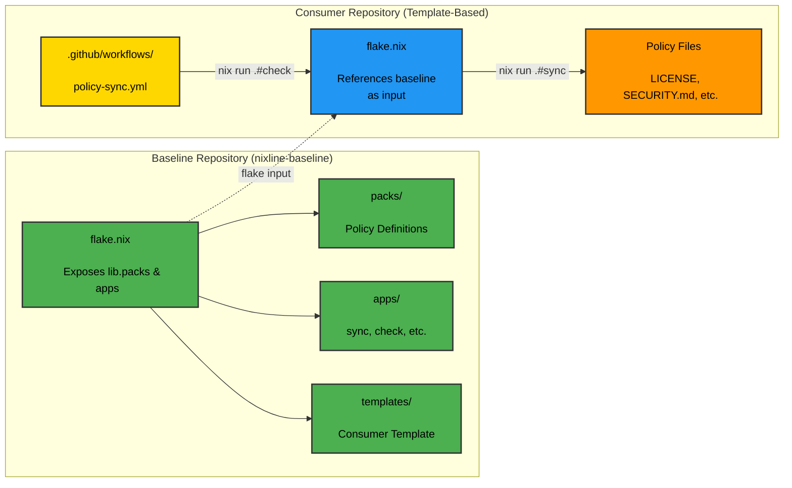
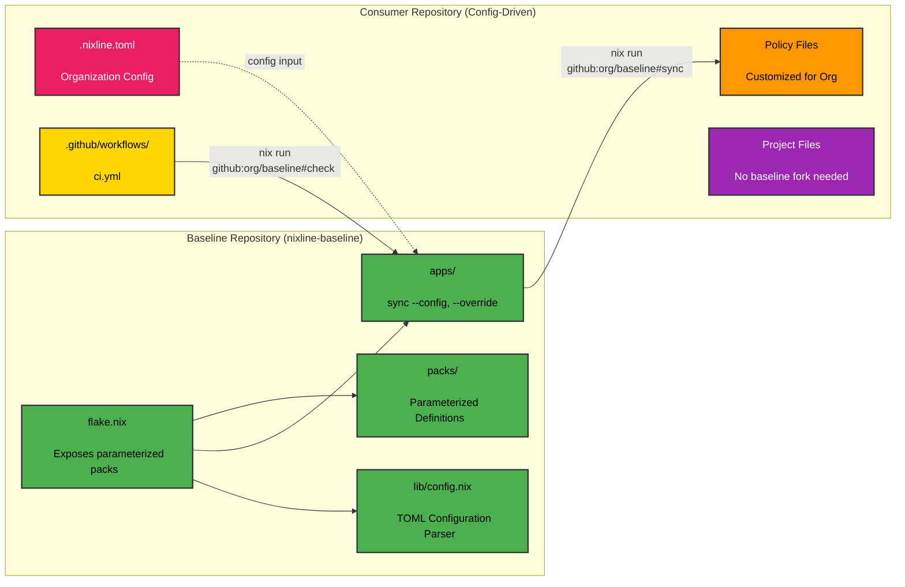
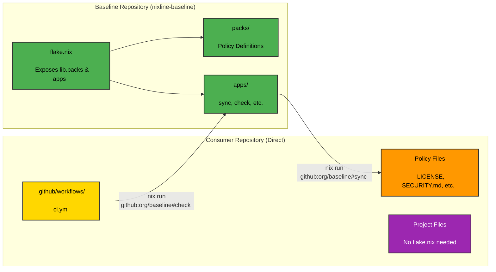

# NixLine Baseline

The **NixLine Baseline** defines the foundational Nix expressions and policies used by all repositories in the [NixLine-org](https://github.com/NixLine-org) organization.
It provides the shared Nix logic, governance rules and automation logic that all NixLine consumer repositories rely on.

## Table of Contents

- [What is NixLine?](#what-is-nixline)
- [Purpose](#purpose)
- [Architecture](#architecture)
- [Usage](#usage)
  - [Baseline Apps](#baseline-apps)
  - [Quick Start for Consumer Repos](#quick-start-for-consumer-repos)
- [Policy Packs](#policy-packs)
- [Configuration File Reference](#configuration-file-reference)
- [Migrating Existing Policies](#migrating-existing-policies)
- [Understanding Pack Propagation](#understanding-pack-propagation)
- [Recommended Implementation](#recommended-implementation)
- [Customization Checklist](#customization-checklist)
- [Tagging Policy](#tagging-policy)
- [NixLine vs Traditional Policy Distribution](#nixline-vs-traditional-policy-distribution)
- [Importance of the Baseline](#importance-of-the-baseline)

---

## What is NixLine?

**NixLine** provides organization-wide CI governance and policy enforcement through Nix flakes.

**Key advantage:** Instead of creating PRs that require manual review when policies change, NixLine **instantly materializes** the latest policies from your baseline using Nix flake inputs.

---

## Purpose

NixLine uses a **hybrid architecture** with two types of governance:

### 1. Persistent Policies (Committed)
Files like `LICENSE`, `SECURITY.md`, `.editorconfig` are materialized and committed to consumer repos for visibility and GitHub integration.

### 2. Pure Nix Apps (No Files)
Apps like pack creation and policy import tools run via `nix run .#app` with no file materialization.

Consumer repositories reference the baseline as a flake input, pulling policy updates instantly without pull requests.

---

## Consumption Patterns

NixLine supports **three consumption patterns** for consumer repositories:

### 1. Template-Based (Recommended for Organizations)

Consumer repositories use the baseline template which includes a `flake.nix` that references the baseline as an input:

```bash
# Initialize from template
nix flake init -t github:NixLine-org/nixline-baseline

# Run apps locally (baseline referenced as input)
nix run .#sync
nix run .#check
```

**Benefits:** Full Nix flake integration, local development, customizable pack selection per repo.

### 2. Configuration-Driven (Recommended for Organizations)

Consumer repositories use `.nixline.toml` configuration files for customization without forking:

```bash
# Run apps with configuration support
nix run github:NixLine-org/nixline-baseline#sync
nix run github:NixLine-org/nixline-baseline#sync -- --config .nixline.toml
nix run github:NixLine-org/nixline-baseline#sync -- --override org.name=MyCompany
```

**Benefits:** Full customization without baseline forking, organization-specific branding, selective pack adoption.

The [nixline-demo2](https://github.com/NixLine-org/nixline-demo2) repository demonstrates the **configuration-driven** pattern.

### 3. Direct Consumption (Recommended for Simple Projects)

Consumer repositories call baseline apps directly without customization:

```bash
# Run apps directly from baseline
nix run github:NixLine-org/nixline-baseline#sync
nix run github:NixLine-org/nixline-baseline#check
```

**Benefits:** No local flake.nix needed, simplest setup, always uses latest baseline.

The [nixline-demo1](https://github.com/NixLine-org/nixline-demo1) repository demonstrates the **direct consumption** pattern.

---

## Architecture

### Template-Based Pattern



### Configuration-Driven Pattern



### Direct Consumption Pattern



### Repository Types

1. **`.github` Repository** ([NixLine-org/.github](https://github.com/NixLine-org/.github))
   - Contains reusable GitHub Actions workflows
   - Referenced via `uses: YOUR-ORG/.github/.github/workflows/nixline-ci.yml@stable`

2. **Baseline Repository** (this repo)
   - Stores Nix-based policy definitions ("packs")
   - Exposes packs as flake lib outputs
   - Provides migration tools (import-policy, fetch-license)
   - Provides consumer template via `nix flake init -t`
   - Organizations fork this to create their own governance baseline

3. **Consumer Repositories** ([nixline-demo1](https://github.com/NixLine-org/nixline-demo1))
   - Your actual projects
   - Reference baseline as a flake input
   - Run `nix run .#sync` to materialize persistent policies
   - Run utility apps for pack creation and policy import

---

## Usage

### Baseline Apps

The baseline exposes apps for setup and migration. These can be run two ways:

**Direct consumption:**
```bash
# Materialize persistent policies
nix run github:NixLine-org/nixline-baseline#sync

# Configuration-driven consumption
nix run github:NixLine-org/nixline-baseline#sync -- --config .nixline.toml
nix run github:NixLine-org/nixline-baseline#sync -- --override org.name=MyCompany
nix run github:NixLine-org/nixline-baseline#sync -- --dry-run

# Validate policies match baseline
nix run github:NixLine-org/nixline-baseline#check

# Import existing policy files
nix run github:NixLine-org/nixline-baseline#import-policy -- --auto

# Fetch license from SPDX
nix run github:NixLine-org/nixline-baseline#fetch-license -- Apache-2.0 --holder "ACME Corp"

# Create a new pack
nix run github:NixLine-org/nixline-baseline#create-pack flake8
```

**Template-based (after `nix flake init -t`):**
```bash
# Materialize persistent policies
nix run .#sync

# Validate policies match baseline
nix run .#check

# Additional utility apps available
nix run .#create-pack <name>
nix run .#import-policy -- --auto
nix run .#fetch-license -- Apache-2.0 --holder "My Company"
```

### Quick Start for Consumer Repos

Choose one of two consumption patterns:

#### Option 1: Direct Consumption (Simple)

For simple projects that don't need local flake customization:

```bash
# Just sync policies directly
nix run github:NixLine-org/nixline-baseline#sync

# Verify policies are in sync
nix run github:NixLine-org/nixline-baseline#check

# Commit the materialized policy files
git add LICENSE SECURITY.md .editorconfig .github/
git commit -m "add NixLine policies"
```

**Customize packs with command line arguments:**
```bash
# Include only specific packs
nix run github:NixLine-org/nixline-baseline#sync -- --packs editorconfig,license,codeowners

# Exclude specific packs from defaults
nix run github:NixLine-org/nixline-baseline#sync -- --exclude security,dependabot

# Check only specific packs
nix run github:NixLine-org/nixline-baseline#check -- --packs editorconfig,license
```

**Or use environment variable (fallback):**
```bash
# Environment variable approach
NIXLINE_PACKS="editorconfig,license,dependabot" nix run github:NixLine-org/nixline-baseline#sync
```

**CI setup for direct consumption:**
```yaml
# .github/workflows/ci.yml
name: CI
on: [push, pull_request]
jobs:
  policy-check:
    runs-on: ubuntu-latest
    steps:
      - uses: actions/checkout@v4
      - uses: cachix/install-nix-action@v31
      - name: Verify policies are in sync
        run: nix run github:NixLine-org/nixline-baseline#check
```

See [nixline-demo1](https://github.com/NixLine-org/nixline-demo1) for a complete example.

#### Option 2: Configuration-Driven (Organization Customization)

For organizations that want full customization without forking the baseline:

**Create configuration file:**
```toml
# .nixline.toml
[organization]
name = "MyCompany"
security_email = "security@mycompany.com"
default_team = "@MyCompany/maintainers"

[packs]
enabled = ["editorconfig", "codeowners", "security", "license"]

[packs.codeowners]
rules = [
  { pattern = "*", owners = ["@MyCompany/maintainers"] },
  { pattern = "*.py", owners = ["@MyCompany/python-team"] }
]

[packs.editorconfig]
indent_size = 4
line_length = 100
```

**Sync with configuration:**
```bash
# Use configuration file
nix run github:NixLine-org/nixline-baseline#sync

# Preview changes
nix run github:NixLine-org/nixline-baseline#sync -- --dry-run

# Override specific values
nix run github:NixLine-org/nixline-baseline#sync -- --override org.name=AnotherCompany

# Use custom config file
nix run github:NixLine-org/nixline-baseline#sync -- --config my-config.toml
```

**Generated files will include:**
- Organization branding (MyCompany in CODEOWNERS, security email in SECURITY.md)
- Custom pack selection (only specified packs materialized)
- Pack-specific customization (custom indentation, team ownership rules)

**Benefits:**
- No baseline forking required
- Organization-specific customization
- Instant updates from upstream baseline
- Configuration-driven policy inheritance

See [nixline-demo2](https://github.com/NixLine-org/nixline-demo2) for a complete example.

#### Option 3: Template-Based (Full Featured)

For organizations that need local flake customization and additional apps:

```bash
# Initialize from template
nix flake init -t github:NixLine-org/nixline-baseline
```

This copies files from the baseline's `templates/consumer/` directory into your current directory, giving you a ready-to-use consumer repository.

**What you get:**

- `flake.nix` - Consumer flake that references the baseline as an input and exposes sync/check apps
- `.github/workflows/policy-sync.yml` - Automated weekly policy sync workflow
- `.pre-commit-config.yaml` - Pre-commit hooks configuration
- `.gitignore` - Standard ignores for Nix projects
- `flake.lock` - Pinned dependencies

**Important:** The consumer repository's `flake.nix` is different from the baseline repository's `flake.nix`:

- **Baseline `flake.nix`** (this repo) - Exposes the packs library and utility apps for all consumers
- **Consumer `flake.nix`** (from template) - Configures which packs to use and implements sync/check for that specific repo

**Customize enabled packs:**

Edit the `persistentPacks` list in your consumer repository's `flake.nix` (not the baseline):

```nix
# Select which packs to enable
persistentPacks = [
  "editorconfig"   # Code formatting standards
  "license"        # Repository license
  "security"       # Security policy
  "codeowners"     # Code ownership rules
  "dependabot"     # Dependabot configuration
];
```

This list controls which policy files are materialized into your repository when running `nix run .#sync`. The consumer template includes this configuration by default. See [`templates/consumer/flake.nix`](./templates/consumer/flake.nix) for the full implementation.

**First-time setup:**

After initializing a consumer repository, you must sync the policy files:

```bash
# Materialize policy files from baseline
nix run .#sync

# Verify policies are in sync
nix run .#check

# Commit the materialized policy files
git add LICENSE SECURITY.md .editorconfig .github/CODEOWNERS .github/dependabot.yml
git commit -m "add NixLine policies"
```

**Important:** CI will fail until you run `nix run .#sync` and commit the policy files. This is expected behavior for new consumer repositories.

**Available apps:**

```bash
# Check policies match baseline
nix run .#check

# Sync policies from baseline
nix run .#sync

# Create new policy pack
nix run .#create-pack <name>

# Import existing policies
nix run .#import-policy -- --auto

# Fetch license from SPDX
nix run .#fetch-license -- Apache-2.0 --holder "My Company"
```

The policy sync workflow runs automatically weekly on Sunday at 2 PM UTC, checking for baseline updates and committing any changes.

---

## Policy Packs

### Persistent Packs (Committed to Repos)

These packs materialize files that should be committed for visibility and GitHub integration:

| Pack | Purpose | Files Materialized |
|------|---------|-------------------|
| `editorconfig` | Code formatting standards | `.editorconfig` |
| `license` | Apache 2.0 license | `LICENSE` |
| `security` | Security policy and reporting | `SECURITY.md` |
| `codeowners` | Code ownership and review rules | `.github/CODEOWNERS` |
| `dependabot` | Dependabot configuration | `.github/dependabot.yml` |

### Pure Apps (No File Materialization)

These run as Nix apps. Usage depends on consumption pattern:

| App | Purpose | Direct Consumption | Template-Based |
|-----|---------|-------------------|----------------|
| `sync` | Materialize persistent policies | `nix run github:ORG/nixline-baseline#sync` | `nix run .#sync` |
| `check` | Validate policies match baseline | `nix run github:ORG/nixline-baseline#check` | `nix run .#check` |
| `create-pack` | Create new policy pack template | `nix run github:ORG/nixline-baseline#create-pack <name>` | `nix run .#create-pack <name>` |
| `import-policy` | Import existing policy files | `nix run github:ORG/nixline-baseline#import-policy` | `nix run .#import-policy` |
| `fetch-license` | Fetch license from SPDX | `nix run github:ORG/nixline-baseline#fetch-license` | `nix run .#fetch-license` |

### Creating New Packs

To add custom policies (like flake8 configuration), use the pack creation app:

```bash
# Create a new pack with template (direct consumption)
nix run github:NixLine-org/nixline-baseline#create-pack flake8

# Or if using template-based approach
nix run .#create-pack flake8

# List example pack ideas
nix run github:NixLine-org/nixline-baseline#create-pack -- --list-examples
```

This generates `packs/flake8.nix` with a template structure. Edit the file to define your configuration:

```nix
{ pkgs, lib }:

{
  files = {
    ".flake8" = ''
      [flake8]
      max-line-length = 88
      extend-ignore = E203, W503
      exclude = .git,__pycache__,build,dist
    '';
  };

  checks = [];
}
```

**Add to consumer repository:**

Edit your consumer's `flake.nix` to include the new pack:

```nix
persistentPacks = [
  "editorconfig"
  "license"
  "security"
  "codeowners"
  "dependabot"
  "flake8"        # Add your new pack
];
```

**Materialize the new policy:**

```bash
# Direct consumption
nix run github:YOUR-ORG/nixline-baseline#sync

# Or template-based
nix run .#sync    # Materializes .flake8 file

git add .flake8
git commit -m "add flake8 configuration"
```

The pack will now be included in automated policy sync across all consumer repositories that enable it.

---

## Configuration File Reference

### .nixline.toml Structure

NixLine supports configuration-driven customization via `.nixline.toml` files. This enables organization-specific branding and policy customization without forking the baseline.

Configuration parsing is handled by [`lib/config.nix`](./lib/config.nix) which supports TOML loading, parameter validation and CLI override integration.

```toml
[baseline]
repo = "github:NixLine-org/nixline-baseline"
ref = "stable"

[organization]
name = "MyCompany"
security_email = "security@mycompany.com"
default_team = "@MyCompany/maintainers"

[packs]
enabled = ["editorconfig", "codeowners", "security", "license", "precommit"]

[packs.editorconfig]
indent_size = 4
line_length = 100
charset = "utf-8"
end_of_line = "lf"

[packs.editorconfig.languages]
python = { indent_size = 4, max_line_length = 88 }
javascript = { indent_size = 2 }

[packs.codeowners]
rules = [
  { pattern = "*", owners = ["@MyCompany/maintainers"] },
  { pattern = "*.py", owners = ["@MyCompany/python-team"] },
  { pattern = "*.js", owners = ["@MyCompany/frontend-team"] },
  { pattern = "docs/**", owners = ["@MyCompany/docs-team"] }
]

[packs.security]
response_time = "within 24 hours"
disclosure_policy = "coordinated"
supported_versions = [
  { version = "2.x.x", supported = true },
  { version = "1.x.x", supported = false }
]

[packs.license]
type = "MIT"
holder = "MyCompany, Inc."
year = "2024"

[packs.precommit]
hooks = ["trailing-whitespace", "black", "flake8", "prettier"]
python_version = "3.11"
black_line_length = 88
```

### Configuration Sections

#### `[baseline]`
- `repo`: GitHub repository URL for the baseline
- `ref`: Git reference to use (stable, main, or specific tag)

#### `[organization]`
- `name`: Organization name used in CODEOWNERS and documentation
- `security_email`: Contact email for security vulnerabilities
- `default_team`: Default team for code ownership

#### `[packs]`
- `enabled`: Array of pack names to materialize

#### Pack-Specific Sections

Each pack can have its own configuration section:

**`[packs.editorconfig]`**
- `indent_size`: Default indentation size
- `line_length`: Maximum line length
- `charset`: Character encoding
- `end_of_line`: Line ending style
- `languages`: Language-specific overrides

**`[packs.codeowners]`**
- `rules`: Array of ownership rules with pattern and owners

**`[packs.security]`**
- `response_time`: Expected response time for vulnerabilities
- `disclosure_policy`: Disclosure approach (coordinated, immediate)
- `supported_versions`: Version support matrix

**`[packs.license]`**
- `type`: License type (MIT, Apache-2.0, etc.)
- `holder`: Copyright holder
- `year`: Copyright year

**`[packs.precommit]`**
- `hooks`: Array of pre-commit hooks to enable
- `python_version`: Python version for Python hooks
- `black_line_length`: Line length for Black formatter

### CLI Options

Override configuration values at runtime:

```bash
# Override organization settings
nix run .#sync -- --override org.name=AnotherCompany
nix run .#sync -- --override org.security_email=sec@other.com

# Use custom config file
nix run .#sync -- --config production.toml

# Preview changes without applying
nix run .#sync -- --dry-run

# Combine options
nix run .#sync -- --config .nixline.toml --override org.name=TestCorp --dry-run
```

See [`examples/nixline.toml`](./examples/nixline.toml) for a complete configuration example.

---

## Migrating Existing Policies

### Import Existing Policy Files

**Auto-import all recognized files:**

```bash
nix run github:NixLine-org/nixline-baseline#import-policy -- --auto
```

**Import specific file:**

```bash
nix run github:NixLine-org/nixline-baseline#import-policy -- --file .editorconfig
```

**Supported policy files:**
- `.editorconfig` → editorconfig pack
- `LICENSE` → license pack (or use fetch-license)
- `SECURITY.md` → security pack
- `.github/CODEOWNERS` → codeowners pack
- `.github/dependabot.yml` → dependabot pack

### Fetch License from SPDX

**Fetch Apache 2.0 license:**

```bash
nix run github:NixLine-org/nixline-baseline#fetch-license -- Apache-2.0 --holder "My Company" --year 2025
```

**Fetch MIT license:**

```bash
nix run github:NixLine-org/nixline-baseline#fetch-license -- MIT --holder "ACME Corp"
```

**List common licenses:**

```bash
nix run github:NixLine-org/nixline-baseline#fetch-license -- --list
```

The import and fetch tools will:
1. Read your existing file or fetch from SPDX
2. Generate properly formatted pack files in `packs/`
3. Preserve your content while making it Nix-compatible

After importing, you can customize the generated packs and commit them to your forked baseline.

---

## Understanding Pack Propagation

**How it works:**

1. You edit a pack file in your forked baseline (e.g., `packs/license.nix`)
2. You commit and push to your baseline repo
3. You re-tag `stable` in your baseline repo
4. **All consumer repos automatically get the updated file on their next sync**

No pull requests for baseline changes. No manual updates. No drift.

This is the key difference from traditional policy distribution systems that use automated pull requests - changes propagate instantly through flake updates instead of requiring PR reviews.

### Automated Policy Sync

Consumer repositories can enable automated policy synchronization using the `policy-sync.yml` workflow from the [`.github` repository](https://github.com/NixLine-org/.github):

```yaml
# .github/workflows/policy-sync.yml (included in consumer template)
name: Policy Sync

on:
  # Run weekly on Sunday at 2 PM UTC
  schedule:
    - cron: '0 14 * * 0'

  workflow_dispatch:

jobs:
  sync:
    uses: YOUR-ORG/.github/.github/workflows/nixline-policy-sync.yml@stable
```

**How automated sync works:**

1. **Weekly cron** triggers the reusable workflow
2. **Workflow runs** sync/check commands to validate policies
3. **If out of sync**, materializes updated policy files
4. **Auto-commits and pushes** changes directly to main branch

Note: Workflows use the consumption pattern configured for that repository (template-based or direct).

This provides instant policy materialization without PR bottlenecks. Organizations that require review can use branch protection rules to enforce PR workflows.

**Customizing the schedule:**

Edit the `cron` schedule in your consumer repo's workflow file:

```yaml
schedule:
  - cron: '0 14 * * 0'  # Sunday 2 PM UTC (default)
  - cron: '0 9 * * 1'   # Monday 9 AM UTC
  - cron: '0 0 1 * *'   # First day of month at midnight
```

**Branch protection for review:**

If your organization requires review before policy changes are applied, configure branch protection rules:

```yaml
# Require PR reviews for main branch
# Changes will be pushed to a branch instead and require PR
# Configure this in your repository settings
```

---

## Recommended Implementation

### Solving the "Hundreds of Repos" Problem

Large organizations often manage hundreds or thousands of repositories that need consistent policies. When a security policy changes, a new license is adopted or coding standards are updated, that change must propagate to every repository in the organization.

The traditional governance approach requires creating individual pull requests to each repository, having them reviewed by repository owners and manually merging them. For an organization with 500 repositories, a single policy change creates 500 separate pull requests that each require human attention. This creates massive operational overhead and delays policy adoption across the organization.

Organizations face a core tension when implementing governance at scale between maintaining review processes and avoiding operational bottlenecks.

### Core Tension

**Option A: Automated Sync**
The automated policy sync workflow runs weekly and commits changes directly to the main branch. This eliminates the manual overhead of creating hundreds of pull requests across repositories when baseline policies change. However, it bypasses the review process entirely, which some organizations require for governance.

**Option B: Manual Sync**
Users run sync commands locally and create pull requests manually for review. This maintains the review process and audit trail that many organizations need. However, it recreates the original bottleneck problem where policy updates require manual intervention across potentially hundreds of repositories.

### The Hybrid Solution

The recommended approach combines automation with governance controls using GitHub's branch protection features. Configure branch protection rules that require pull requests even for automated workflows.

When baseline repository changes are reviewed and approved, they should be free to propagate and sync to external repositories without additional review. Auto-merging should be enabled as long as CI build tests pass.

The automated workflow creates pull requests instead of committing directly to main. Code owners can auto-approve policy-only changes while maintaining an audit trail. Auto-merge eliminates manual work while GitHub's branch protection provides the governance controls organizations need.

This approach solves the policy cascade bottleneck by handling the "hundreds of repos" problem through automation, while branch protection provides review gates where needed. When a single policy change in the baseline needs to flow out to hundreds of consumer repositories, automation eliminates the manual overhead while maintaining governance controls.

### Pure Apps in CI

Pure Nix apps for pack creation and policy management can be run in CI workflows for automated governance tasks without requiring file materialization in the repository.

---

## Customization Checklist

When you fork this baseline for your organization, follow this checklist to customize it for your needs:

### Before You Start

- [ ] Fork both [`.github`](https://github.com/NixLine-org/.github) and [`nixline-baseline`](https://github.com/NixLine-org/nixline-baseline) repositories to your organization
- [ ] Clone your forked `nixline-baseline` locally
- [ ] Have your organization details ready (name, copyright holder, security contact)

### Required Customizations

#### 1. License Pack

**Option A: Fetch from SPDX (Recommended)**
```bash
cd nixline-baseline
nix run .#fetch-license -- Apache-2.0 --holder "ACME Corp" --year 2025
git add packs/license.nix
```

**Option B: Import existing LICENSE file**
```bash
nix run .#import-policy -- --file LICENSE
# Edit packs/license.nix to adjust copyrightHolder and copyrightYear
git add packs/license.nix
```

**Option C: Edit manually**
- [ ] Edit `packs/license.nix`
- [ ] Update `copyrightHolder` variable
- [ ] Update `copyrightYear` variable
- [ ] Replace license text if needed

#### 2. Security Pack

- [ ] Edit `packs/security.nix`
- [ ] Update `securityEmail` to your security team's email
- [ ] Adjust `responseTime` if needed
- [ ] Review `supportedVersions` list

#### 3. Code Owners Pack

- [ ] Edit `packs/codeowners.nix`
- [ ] Update `org` variable to your GitHub organization name
- [ ] Customize `rules` list with your team structure

#### 4. Editor Config Pack

- [ ] Edit `packs/editorconfig.nix`
- [ ] Customize `defaultSettings` for your org's standards
- [ ] Add language-specific rules in `languageSettings`

#### 5. Dependabot Pack

- [ ] Edit `packs/dependabot.nix`
- [ ] Review `updates` list for your tech stack
- [ ] Adjust `schedule` if needed (daily, weekly, monthly)

### Optional Customizations

#### 6. Import Existing Policies

If you have existing policy files, import them:

```bash
# Auto-import all recognized files
nix run .#import-policy -- --auto

# Or import specific files
nix run .#import-policy -- --file .editorconfig
nix run .#import-policy -- --file SECURITY.md
nix run .#import-policy -- --file .github/CODEOWNERS
```

Review and adjust the generated packs as needed.

### Commit and Tag

Once customizations are complete:

```bash
# Commit all changes
git add packs/
git commit -m "feat: customize baseline for YOUR-ORG"
git push origin main

# Tag as stable
git tag -a stable -m "Initial baseline for YOUR-ORG"
git push origin stable
```

### Test Your Baseline

Before rolling out to consumer repos, test locally:

```bash
# In a test directory
nix flake init -t github:YOUR-ORG/nixline-baseline

# Sync policies
nix run .#sync

# Verify files
ls -la LICENSE SECURITY.md .editorconfig .github/CODEOWNERS

# Check content matches your customizations
cat LICENSE  # Should show your org's copyright
cat SECURITY.md  # Should show your security email
```

### Update `.github` Repository

Update your forked `.github` repository workflows to reference your baseline:

```yaml
# In .github/.github/workflows/nixline-ci.yml
- name: Materialize policies
  run: |
    nix run "github:YOUR-ORG/nixline-baseline?ref=${{ inputs.channel }}"#sync
```

Tag and push:

```bash
git add .
git commit -m "feat: update workflows for YOUR-ORG baseline"
git push origin main

git tag -a stable -m "Initial stable release"
git push origin stable
```

### Rollout to Consumer Repos

Now your baseline is ready! Consumer repos can use it:

```bash
# In any project repo
nix flake init -t github:YOUR-ORG/nixline-baseline

# Customize which packs to enable in flake.nix
# Then sync and commit
nix run .#sync
git add LICENSE SECURITY.md .editorconfig .github/
git commit -m "feat: add NixLine policies"
```

---

## Tagging Policy

This repository is versioned via the `stable` tag to provide a consistent reference point for NixLine workflows.

To update the tag after any change:

```bash
git push origin main
git tag -d stable
git push origin :refs/tags/stable
git tag -a stable -m "Update stable tag after baseline changes"
git push origin stable
```

Always verify CI passes before re-tagging `stable`.

---

## NixLine vs Traditional Policy Distribution

Traditional policy distribution systems use automated pull requests to propagate policy updates across repositories. When a baseline changes, the system creates PRs in every consumer repository, requiring manual review and merge.

| Feature | Traditional (PR-based) | NixLine (Flake-based) |
|---------|------------------------|------------------------|
| **Distribution** | Automated PRs | Direct Nix materialization |
| **Review Process** | Manual PR review required | No PRs needed |
| **Update Speed** | Hours/days (PR workflow) | Instant (next sync) |
| **Customization** | Fork + modify files | Nix expressions |
| **Reproducibility** | Git-based | Nix-based (hermetic) |
| **Configuration** | YAML config files | Nix flake inputs |

**Key Advantage:** Consumer repos automatically get the latest policies through flake inputs - no PR bottleneck!

---

## Importance of the Baseline

This repository serves as the **official baseline** for NixLine.
It defines how organizational workflows interpret and apply shared policy, serving as the root of consistency and traceability for all consumer repositories.

When another organization forks NixLine, this repository is where they establish **their own governance baseline** - defining what policies, governance and automation rules will apply across their environment.
By maintaining and versioning this baseline, each organization can evolve its own standards while still inheriting the reproducible and declarative structure that NixLine provides.
