# NixLine Baseline

The **NixLine Baseline** defines the foundational Nix expressions and policies used by all repositories in the [NixLine-org](https://github.com/NixLine-org) organization.
It provides the shared Nix logic, governance rules and automation logic that all NixLine consumer repositories rely on.

---

## What is NixLine?

**NixLine** provides organization-wide CI governance and policy enforcement through Nix flakes.

**Key advantage:** Instead of creating PRs that require manual review when policies change, NixLine **instantly materializes** the latest policies from your baseline using Nix flake inputs.

---

## Purpose

NixLine uses a **hybrid architecture** with two types of governance:

### 1. Persistent Policies (Committed)
Files like `LICENSE`, `SECURITY.md`, `.editorconfig` are materialized and committed to consumer repos for visibility and GitHub integration.

### 2. Pure Nix Apps (No Files)
Apps like SBOM generation, flake updates and pre-commit setup run via `nix run .#app` with no file materialization.

Consumer repositories reference the baseline as a flake input, pulling policy updates instantly without pull requests.

---

## Architecture

```mermaid
graph LR
    subgraph baseline["&nbsp;&nbsp;&nbsp;&nbsp;Baseline Repository (nixline-baseline)&nbsp;&nbsp;&nbsp;&nbsp;"]
        B1["&nbsp;&nbsp;flake.nix&nbsp;&nbsp;<br/>&nbsp;<br/>&nbsp;&nbsp;Exposes lib.packs & apps&nbsp;&nbsp;"]
        B2["&nbsp;&nbsp;packs/&nbsp;&nbsp;<br/>&nbsp;<br/>&nbsp;&nbsp;Policy Definitions&nbsp;&nbsp;"]
        B3["&nbsp;&nbsp;apps/&nbsp;&nbsp;<br/>&nbsp;<br/>&nbsp;&nbsp;sync, check,&nbsp;&nbsp;<br/>&nbsp;&nbsp;import-policy,&nbsp;&nbsp;<br/>&nbsp;&nbsp;fetch-license&nbsp;&nbsp;"]
        B4["&nbsp;&nbsp;templates/&nbsp;&nbsp;<br/>&nbsp;<br/>&nbsp;&nbsp;Consumer Template&nbsp;&nbsp;<br/>&nbsp;&nbsp;+ policy-sync.yml&nbsp;&nbsp;"]
        B1 --> B2
        B1 --> B3
        B1 --> B4
    end

    subgraph consumer["&nbsp;&nbsp;&nbsp;&nbsp;Consumer Repository&nbsp;&nbsp;&nbsp;&nbsp;"]
        C1["&nbsp;&nbsp;flake.nix&nbsp;&nbsp;<br/>&nbsp;<br/>&nbsp;&nbsp;References baseline&nbsp;&nbsp;<br/>&nbsp;&nbsp;as input&nbsp;&nbsp;"]
        C2["&nbsp;&nbsp;Persistent Files&nbsp;&nbsp;<br/>&nbsp;<br/>&nbsp;&nbsp;LICENSE,&nbsp;&nbsp;<br/>&nbsp;&nbsp;SECURITY.md,&nbsp;&nbsp;<br/>&nbsp;&nbsp;etc.&nbsp;&nbsp;"]
        C3["&nbsp;&nbsp;Pure Apps&nbsp;&nbsp;<br/>&nbsp;<br/>&nbsp;&nbsp;sbom,&nbsp;&nbsp;<br/>&nbsp;&nbsp;flake-update,&nbsp;&nbsp;<br/>&nbsp;&nbsp;setup-hooks&nbsp;&nbsp;"]
        C4["&nbsp;&nbsp;policy-sync.yml&nbsp;&nbsp;<br/>&nbsp;<br/>&nbsp;&nbsp;Automated&nbsp;&nbsp;<br/>&nbsp;&nbsp;weekly sync&nbsp;&nbsp;"]
    end

    subgraph actions["&nbsp;&nbsp;&nbsp;&nbsp;GitHub Actions (.github repo)&nbsp;&nbsp;&nbsp;&nbsp;"]
        G1["&nbsp;&nbsp;Reusable Workflows&nbsp;&nbsp;<br/>&nbsp;<br/>&nbsp;&nbsp;nixline-policy-sync.yml&nbsp;&nbsp;"]
        G2["&nbsp;&nbsp;Auto-commits&nbsp;&nbsp;<br/>&nbsp;<br/>&nbsp;&nbsp;policy changes&nbsp;&nbsp;"]
    end

    subgraph types["&nbsp;&nbsp;&nbsp;&nbsp;Policy Types&nbsp;&nbsp;&nbsp;&nbsp;"]
        P1["&nbsp;&nbsp;Persistent&nbsp;&nbsp;<br/>&nbsp;<br/>&nbsp;&nbsp;Committed & Visible&nbsp;&nbsp;"]
        P2["&nbsp;&nbsp;Pure Apps&nbsp;&nbsp;<br/>&nbsp;<br/>&nbsp;&nbsp;No Files&nbsp;&nbsp;"]
        P3["&nbsp;&nbsp;Automated&nbsp;&nbsp;<br/>&nbsp;<br/>&nbsp;&nbsp;Instant Sync&nbsp;&nbsp;"]
    end

    B1 -.->|"&nbsp;flake input&nbsp;"| C1
    C1 -->|"&nbsp;nix run .#sync&nbsp;"| C2
    C1 -->|"&nbsp;nix run .#app&nbsp;"| C3
    C4 -->|"&nbsp;cron: Sunday 2PM&nbsp;"| C1
    C4 -.->|"&nbsp;calls workflow&nbsp;"| G1
    G1 -->|"&nbsp;runs nix run .#sync&nbsp;"| C1
    G1 -->|"&nbsp;git push&nbsp;"| C2
    C2 -.-> P1
    C3 -.-> P2
    C4 -.-> P3

    style B1 fill:#4CAF50,color:#000000,stroke:#333,stroke-width:2px
    style B2 fill:#4CAF50,color:#000000,stroke:#333,stroke-width:2px
    style B3 fill:#4CAF50,color:#000000,stroke:#333,stroke-width:2px
    style B4 fill:#4CAF50,color:#000000,stroke:#333,stroke-width:2px
    style C1 fill:#2196F3,color:#000000,stroke:#333,stroke-width:2px
    style C2 fill:#FF9800,color:#000000,stroke:#333,stroke-width:2px
    style C3 fill:#9C27B0,color:#FFFFFF,stroke:#333,stroke-width:2px
    style C4 fill:#FFD700,color:#000000,stroke:#333,stroke-width:2px
    style G1 fill:#E91E63,color:#FFFFFF,stroke:#333,stroke-width:2px
    style G2 fill:#E91E63,color:#FFFFFF,stroke:#333,stroke-width:2px
    style P1 fill:#607D8B,color:#FFFFFF,stroke:#333,stroke-width:2px
    style P2 fill:#607D8B,color:#FFFFFF,stroke:#333,stroke-width:2px
    style P3 fill:#607D8B,color:#FFFFFF,stroke:#333,stroke-width:2px
```



### Repository Types

1. **`.github` Repository** ([NixLine-org/.github](https://github.com/NixLine-org/.github))
   - Contains reusable GitHub Actions workflows
   - Referenced via `uses: YOUR-ORG/.github/.github/workflows/nixline-ci.yml@stable`

2. **Baseline Repository** (this repo)
   - Stores Nix-based policy definitions ("packs")
   - Exposes packs as flake lib outputs
   - Provides migration tools (import-policy, fetch-license)
   - Provides consumer template via `nix flake init -t`
   - Organizations fork this to create their own governance baseline

3. **Consumer Repositories** ([nixline-demo1](https://github.com/NixLine-org/nixline-demo1))
   - Your actual projects
   - Reference baseline as a flake input
   - Run `nix run .#sync` to materialize persistent policies
   - Run `nix run .#sbom` for pure apps

---

## Usage

### Baseline Apps

The baseline exposes four apps for setup and migration:

```bash
# Materialize persistent policies
nix run github:NixLine-org/nixline-baseline#sync

# Validate policies match baseline
nix run github:NixLine-org/nixline-baseline#check

# Import existing policy files
nix run github:NixLine-org/nixline-baseline#import-policy -- --auto

# Fetch license from SPDX
nix run github:NixLine-org/nixline-baseline#fetch-license -- Apache-2.0 --holder "ACME Corp"
```

### Quick Start for Consumer Repos

Initialize a new consumer repository from the baseline template:

```bash
nix flake init -t github:NixLine-org/nixline-baseline
```

This copies files from the baseline's `templates/consumer/` directory into your current directory, giving you a ready-to-use consumer repository.

**What you get:**

- `flake.nix` - Consumer flake that references the baseline as an input and exposes sync/check apps
- `.github/workflows/policy-sync.yml` - Automated weekly policy sync workflow
- `.pre-commit-config.yaml` - Pre-commit hooks configuration
- `.gitignore` - Standard ignores for Nix projects
- `flake.lock` - Pinned dependencies

**Customize enabled packs:**

Edit the `persistentPacks` list in your consumer repository's `flake.nix`:

```nix
# Select which packs to enable
persistentPacks = [
  "editorconfig"   # Code formatting standards
  "license"        # Repository license
  "security"       # Security policy
  "codeowners"     # Code ownership rules
  "dependabot"     # Dependabot configuration
];
```

This list controls which policy files are materialized into your repository when running `nix run .#sync`. The consumer template includes this configuration by default. See [`templates/consumer/flake.nix`](./templates/consumer/flake.nix) for the full implementation.

**Sync persistent policies:**

Materialize policy files and commit them to your repository:

```bash
nix run .#sync
git add LICENSE SECURITY.md .editorconfig .github/CODEOWNERS .github/dependabot.yml
git commit -m "add NixLine policies"
```

**Available apps:**

```bash
# Check policies match baseline
nix run .#check

# Sync policies from baseline
nix run .#sync

# Generate SBOM (CycloneDX + SPDX)
nix run .#sbom

# Update flake.lock and create PR
nix run .#flake-update

# Install pre-commit hooks
nix run .#setup-hooks
```

The policy sync workflow runs automatically weekly on Sunday at 2 PM UTC, checking for baseline updates and committing any changes.

---

## Policy Packs

### Persistent Packs (Committed to Repos)

These packs materialize files that should be committed for visibility and GitHub integration:

| Pack | Purpose | Files Materialized |
|------|---------|-------------------|
| `editorconfig` | Code formatting standards | `.editorconfig` |
| `license` | Apache 2.0 license | `LICENSE` |
| `security` | Security policy and reporting | `SECURITY.md` |
| `codeowners` | Code ownership and review rules | `.github/CODEOWNERS` |
| `dependabot` | Dependabot configuration | `.github/dependabot.yml` |

### Pure Apps (No File Materialization)

These run as Nix apps directly from the consumer flake:

| App | Purpose | Usage |
|-----|---------|-------|
| `sync` | Materialize persistent policies | `nix run .#sync` |
| `check` | Validate policies match baseline | `nix run .#check` |
| `sbom` | Generate CycloneDX + SPDX SBOMs | `nix run .#sbom` |
| `flake-update` | Update flake.lock and create PR | `nix run .#flake-update` |
| `setup-hooks` | Install pre-commit hooks | `nix run .#setup-hooks` |

---

## Migrating Existing Policies

### Import Existing Policy Files

**Auto-import all recognized files:**

```bash
nix run github:NixLine-org/nixline-baseline#import-policy -- --auto
```

**Import specific file:**

```bash
nix run github:NixLine-org/nixline-baseline#import-policy -- --file .editorconfig
```

**Supported policy files:**
- `.editorconfig` → editorconfig pack
- `LICENSE` → license pack (or use fetch-license)
- `SECURITY.md` → security pack
- `.github/CODEOWNERS` → codeowners pack
- `.github/dependabot.yml` → dependabot pack

### Fetch License from SPDX

**Fetch Apache 2.0 license:**

```bash
nix run github:NixLine-org/nixline-baseline#fetch-license -- Apache-2.0 --holder "My Company" --year 2025
```

**Fetch MIT license:**

```bash
nix run github:NixLine-org/nixline-baseline#fetch-license -- MIT --holder "ACME Corp"
```

**List common licenses:**

```bash
nix run github:NixLine-org/nixline-baseline#fetch-license -- --list
```

The import and fetch tools will:
1. Read your existing file or fetch from SPDX
2. Generate properly formatted pack files in `packs/`
3. Preserve your content while making it Nix-compatible

After importing, you can customize the generated packs and commit them to your forked baseline.

---

## Understanding Pack Propagation

**How it works:**

1. You edit a pack file in your forked baseline (e.g., `packs/license.nix`)
2. You commit and push to your baseline repo
3. You re-tag `stable` in your baseline repo
4. **All consumer repos automatically get the updated file on their next sync**

No pull requests for baseline changes. No manual updates. No drift.

This is the key difference from traditional policy distribution systems that use automated pull requests - changes propagate instantly through flake updates instead of requiring PR reviews.

### Automated Policy Sync

Consumer repositories can enable automated policy synchronization using the `policy-sync.yml` workflow from the `.github` repository:

```yaml
# .github/workflows/policy-sync.yml (included in consumer template)
name: Policy Sync

on:
  # Run weekly on Sunday at 2 PM UTC
  schedule:
    - cron: '0 14 * * 0'

  workflow_dispatch:

jobs:
  sync:
    uses: YOUR-ORG/.github/.github/workflows/nixline-policy-sync.yml@stable
```

**How automated sync works:**

1. **Weekly cron** triggers the reusable workflow
2. **Workflow runs** `nix run .#check` to validate policies
3. **If out of sync**, runs `nix run .#sync` to update files
4. **Auto-commits and pushes** changes directly to main branch

This provides instant policy materialization without PR bottlenecks. Organizations that require review can use branch protection rules to enforce PR workflows.

**Customizing the schedule:**

Edit the `cron` schedule in your consumer repo's workflow file:

```yaml
schedule:
  - cron: '0 14 * * 0'  # Sunday 2 PM UTC (default)
  - cron: '0 9 * * 1'   # Monday 9 AM UTC
  - cron: '0 0 1 * *'   # First day of month at midnight
```

**Branch protection for review:**

If your organization requires review before policy changes are applied, configure branch protection rules:

```yaml
# Require PR reviews for main branch
# Changes will be pushed to a branch instead and require PR
# Configure this in your repository settings
```

---

## Customization Checklist

When you fork this baseline for your organization, follow this checklist to customize it for your needs:

### Before You Start

- [ ] Fork both `.github` and `nixline-baseline` repositories to your organization
- [ ] Clone your forked `nixline-baseline` locally
- [ ] Have your organization details ready (name, copyright holder, security contact)

### Required Customizations

#### 1. License Pack

**Option A: Fetch from SPDX (Recommended)**
```bash
cd nixline-baseline
nix run .#fetch-license -- Apache-2.0 --holder "ACME Corp" --year 2025
git add packs/license.nix
```

**Option B: Import existing LICENSE file**
```bash
nix run .#import-policy -- --file LICENSE
# Edit packs/license.nix to adjust copyrightHolder and copyrightYear
git add packs/license.nix
```

**Option C: Edit manually**
- [ ] Edit `packs/license.nix`
- [ ] Update `copyrightHolder` variable
- [ ] Update `copyrightYear` variable
- [ ] Replace license text if needed

#### 2. Security Pack

- [ ] Edit `packs/security.nix`
- [ ] Update `securityEmail` to your security team's email
- [ ] Adjust `responseTime` if needed
- [ ] Review `supportedVersions` list

#### 3. Code Owners Pack

- [ ] Edit `packs/codeowners.nix`
- [ ] Update `org` variable to your GitHub organization name
- [ ] Customize `rules` list with your team structure

#### 4. Editor Config Pack

- [ ] Edit `packs/editorconfig.nix`
- [ ] Customize `defaultSettings` for your org's standards
- [ ] Add language-specific rules in `languageSettings`

#### 5. Dependabot Pack

- [ ] Edit `packs/dependabot.nix`
- [ ] Review `updates` list for your tech stack
- [ ] Adjust `schedule` if needed (daily, weekly, monthly)

### Optional Customizations

#### 6. Import Existing Policies

If you have existing policy files, import them:

```bash
# Auto-import all recognized files
nix run .#import-policy -- --auto

# Or import specific files
nix run .#import-policy -- --file .editorconfig
nix run .#import-policy -- --file SECURITY.md
nix run .#import-policy -- --file .github/CODEOWNERS
```

Review and adjust the generated packs as needed.

### Commit and Tag

Once customizations are complete:

```bash
# Commit all changes
git add packs/
git commit -m "feat: customize baseline for YOUR-ORG"
git push origin main

# Tag as stable
git tag -a stable -m "Initial baseline for YOUR-ORG"
git push origin stable
```

### Test Your Baseline

Before rolling out to consumer repos, test locally:

```bash
# In a test directory
nix flake init -t github:YOUR-ORG/nixline-baseline

# Sync policies
nix run .#sync

# Verify files
ls -la LICENSE SECURITY.md .editorconfig .github/CODEOWNERS

# Check content matches your customizations
cat LICENSE  # Should show your org's copyright
cat SECURITY.md  # Should show your security email
```

### Update `.github` Repository

Update your forked `.github` repository workflows to reference your baseline:

```yaml
# In .github/.github/workflows/nixline-ci.yml
- name: Materialize policies
  run: |
    nix run "github:YOUR-ORG/nixline-baseline?ref=${{ inputs.channel }}"#sync
```

Tag and push:

```bash
git add .
git commit -m "feat: update workflows for YOUR-ORG baseline"
git push origin main

git tag -a stable -m "Initial stable release"
git push origin stable
```

### Rollout to Consumer Repos

Now your baseline is ready! Consumer repos can use it:

```bash
# In any project repo
nix flake init -t github:YOUR-ORG/nixline-baseline

# Customize which packs to enable in flake.nix
# Then sync and commit
nix run .#sync
git add LICENSE SECURITY.md .editorconfig .github/
git commit -m "feat: add NixLine policies"
```

---

## Tagging Policy

This repository is versioned via the `stable` tag to provide a consistent reference point for NixLine workflows.

To update the tag after any change:

```bash
git push origin main
git tag -d stable
git push origin :refs/tags/stable
git tag -a stable -m "Update stable tag after baseline changes"
git push origin stable
```

Always verify CI passes before re-tagging `stable`.

---

## NixLine vs Traditional Policy Distribution

Traditional policy distribution systems use automated pull requests to distribute policy updates. When a baseline changes, the system creates PRs in every consumer repository, requiring manual review and merge.

| Feature | Traditional (PR-based) | NixLine (Flake-based) |
|---------|------------------------|------------------------|
| **Distribution** | Automated PRs | Direct Nix materialization |
| **Review Process** | Manual PR review required | No PRs needed |
| **Update Speed** | Hours/days (PR workflow) | Instant (next sync) |
| **Customization** | Fork + modify files | Nix expressions |
| **Reproducibility** | Git-based | Nix-based (hermetic) |
| **Configuration** | YAML config files | Nix flake inputs |

**Key Advantage:** Consumer repos automatically get the latest policies through flake inputs - no PR bottleneck!

---

## Importance of the Baseline

This repository serves as the **official baseline** for NixLine.
It defines how organizational workflows interpret and apply shared policy, serving as the root of consistency and traceability for all consumer repositories.

When another organization forks NixLine, this repository is where they establish **their own governance baseline** - defining what policies, governance and automation rules will apply across their environment.
By maintaining and versioning this baseline, each organization can evolve its own standards while still inheriting the reproducible and declarative structure that NixLine provides.
