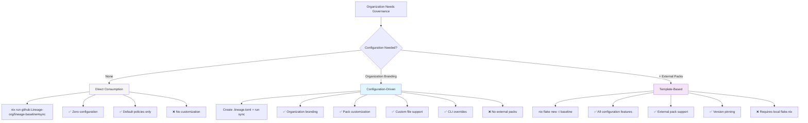
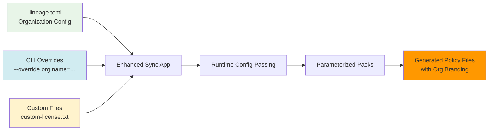
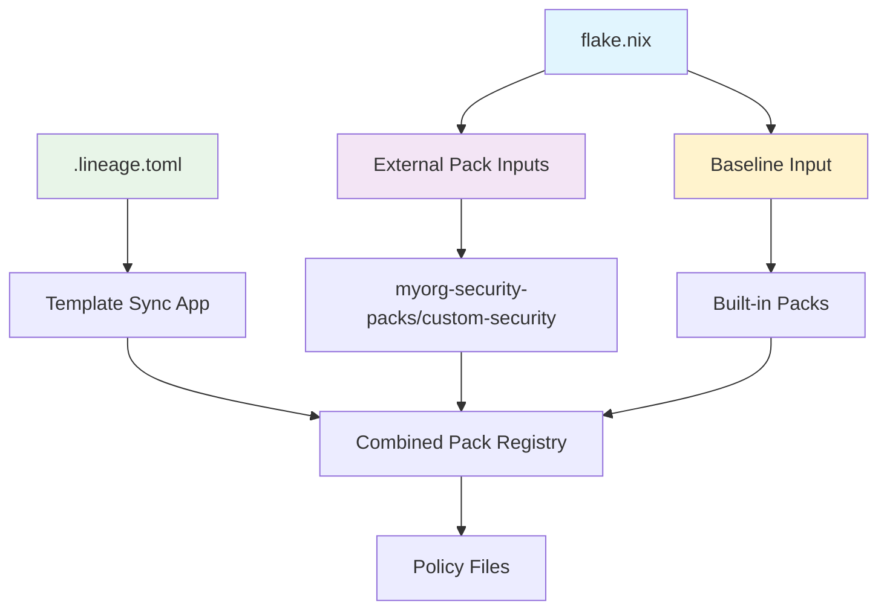
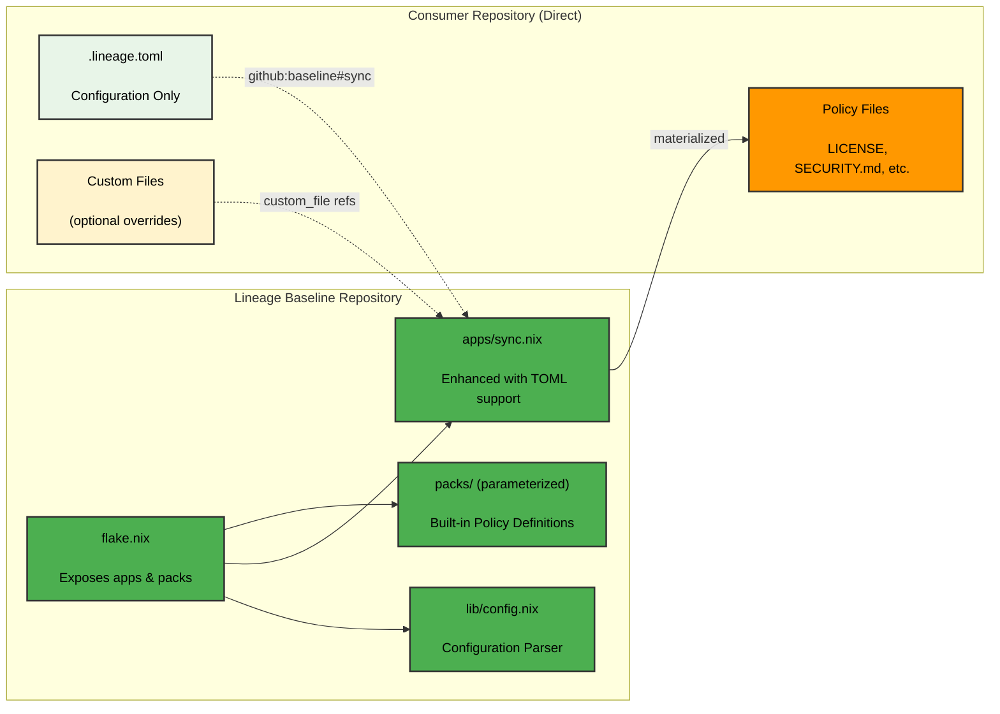
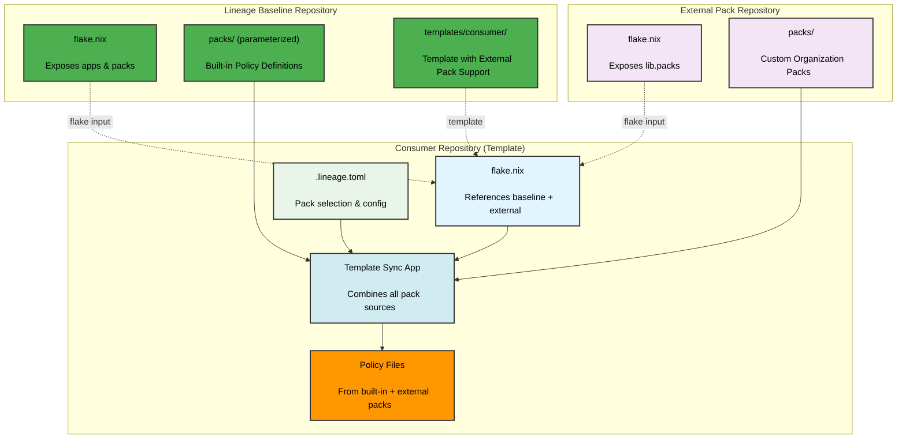
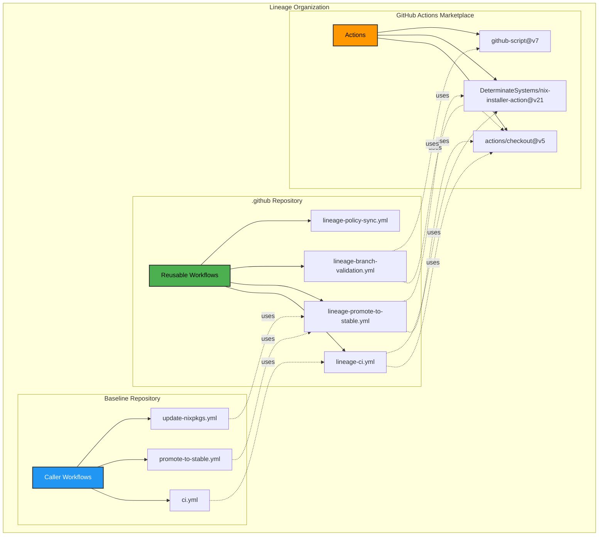

# Architecture & Consumption

## Consumption Patterns

Lineage offers three consumption patterns to match different organizational needs:



### Pattern 1: Direct Consumption (Default)

**Best for**: Quick start with default Lineage policies.

```bash
# No configuration required - uses defaults
nix run github:Lineage-org/lineage-baseline#sync
```

### Pattern 2: Configuration-Driven (Recommended)

**Best for**: Organizations wanting customization without baseline forking.

```bash
# Create configuration file, then sync
nix run github:Lineage-org/lineage-baseline#sync -- --config .lineage.toml
```

**Configuration-Driven Architecture**:


**Example Configuration**:
```toml
# .lineage.toml
[organization]
name = "MyCompany"
security_email = "security@lineage.run"
default_team = "@MyCompany/maintainers"

[packs]
enabled = ["editorconfig", "license", "codeowners"]

[packs.license]
custom_file = "my-license.txt"

[packs.editorconfig]
indent_size = 4
line_length = 100
```

### Pattern 3: Template-Based (With External Packs)

**Best for**: Organizations needing custom packs while avoiding baseline forking.

```bash
# Initialize from template
nix flake new -t github:Lineage-org/lineage-baseline my-repo
cd my-repo

# Add external packs to flake.nix, then sync
nix run .#sync
```

**Architecture**:


---

## Architecture

### Direct Consumption Pattern (Pure Upstream)



### Template Consumption Pattern (With External Packs)



### Repository Types

1. **`.github` Repository** ([Lineage-org/.github](https://github.com/Lineage-org/.github))
   - Contains reusable GitHub Actions workflows
   - Referenced via `uses: YOUR-ORG/.github/.github/workflows/lineage-ci.yml@stable`

2. **Baseline Repository** (this repo)
   - Stores Nix-based policy definitions ("packs")
   - Exposes packs as flake lib outputs
   - Provides migration tools (import-policy, fetch-license)
   - Provides consumer template via `nix flake init -t`
   - Organizations fork this to create their own governance baseline

3. **Consumer Repositories** ([lineage-demo1](https://github.com/Lineage-org/lineage-demo1))
   - Your actual projects
   - Reference baseline as a flake input
   - Run `nix run .#sync` to materialize persistent policies
   - Run utility apps for pack creation and policy import

---

## Workflow Dependencies

The Lineage architecture follows a clean dependency pattern where baseline repositories exclusively use reusable workflows from the `.github` repository, rather than calling GitHub Actions directly.

### Proper Dependency Architecture



### Why This Pattern Matters

**Centralized Maintenance:**
- All GitHub Action versions managed in one place (`.github` repo)
- Dependency updates only need to happen once
- Security patches propagate automatically to all repositories

**Clean Separation:**
- Baseline repositories only know about `.github` workflows
- No direct coupling to external GitHub Actions
- Easier to audit and manage dependencies

**Consistent Patterns:**
- Same approach across all Lineage repositories
- Predictable workflow structure
- Better developer experience

### Implementation Status

Current baseline workflows should only call reusable workflows:

[+] **Correct Pattern:**
```yaml
jobs:
  ci:
    uses: Lineage-org/.github/.github/workflows/lineage-ci.yml@stable
```

[-] **Avoid Direct Action Calls:**
```yaml
steps:
  - uses: actions/checkout@v5
  - uses: DeterminateSystems/nix-installer-action@v21
```

Organizations forking Lineage should maintain this pattern by:
1. Forking both `.github` and `lineage-baseline` repositories
2. Updating workflow references to point to their organization
3. Never calling actions directly from baseline workflows

---

## Understanding Pack Propagation

**How it works:**

1. You edit a pack file in your forked baseline (e.g., `packs/license.nix`)
2. You commit and push to your baseline repo
3. You re-tag `stable` in your baseline repo
4. **All consumer repos automatically get the updated file on their next sync**

No pull requests for baseline changes. No manual updates. No drift.

This is the key difference from traditional policy distribution systems that use automated pull requests - changes propagate instantly through flake updates instead of requiring PR reviews.

---

## Lineage vs Traditional Policy Distribution

Traditional policy distribution systems use automated pull requests to propagate policy updates across repositories. When a baseline changes, the system creates PRs in every consumer repository, requiring manual review and merge.

| Feature | Traditional (PR-based) | Lineage (Flake-based) |
|---------|------------------------|------------------------|
| **Distribution** | Automated PRs | Direct Nix materialization |
| **Review Process** | Manual PR review required | No PRs needed |
| **Update Speed** | Hours/days (PR workflow) | Instant (next sync) |
| **Customization** | Fork + modify files | Nix expressions |
| **Reproducibility** | Git-based | Nix-based (hermetic) |
| **Configuration** | YAML config files | Nix flake inputs |

**Key Advantage:** Consumer repos automatically get the latest policies through flake inputs - no PR bottleneck!
