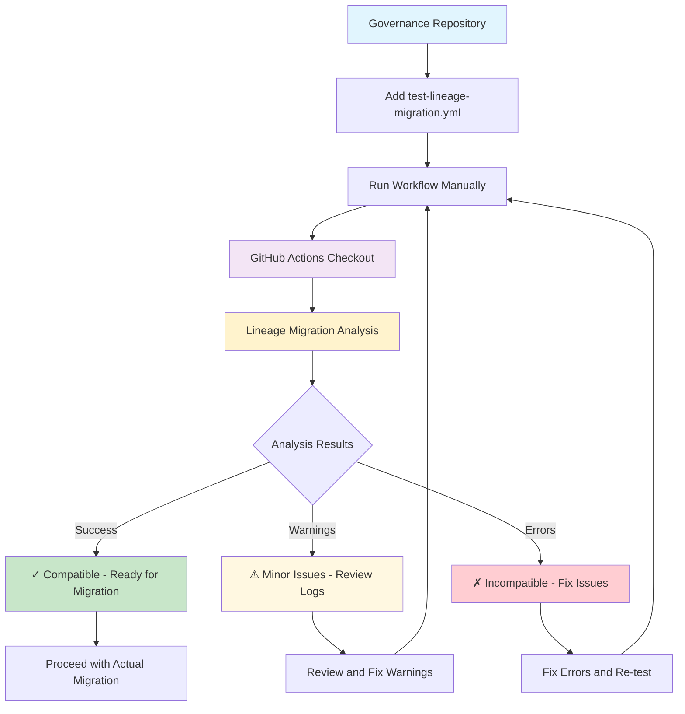

# Governance Migration

Organizations can migrate their existing governance repositories to create custom Lineage baselines automatically using Nix's deterministic fetching capabilities.

## Complete Governance Migration

**Migrate entire governance repository:**

```bash
nix run github:Lineage-org/lineage-baseline#migrate-governance -- \
  --governance-repo https://github.com/yourorg/governance \
  --org-name "Your Organization" \
  --org-email "admin@yourorg.com" \
  --security-email "security@yourorg.com"
```

This will fetch the governance repository using Nix's deterministic fetchGit, analyze it for languages and existing policies, generate appropriate .lineage.toml configuration, import supported governance files as Lineage packs and create a complete baseline directory structure ready for deployment.

## Migration Architecture

The governance migration uses a **Nix-idiomatic approach** for repository fetching:

**URL Input Processing:**
- URLs are fetched using `builtins.fetchGit` for deterministic, cached access
- Commit hashes are automatically pinned for reproducibility
- Nix store caching improves performance on repeated runs
- Works with public and private repositories (with appropriate credentials)

**Local Path Support:**
- Local directories are accessed directly for development workflows
- Useful for testing modifications before pushing to remote repositories

**Benefits:**
- **Deterministic**: Same URL always produces same commit hash
- **Cached**: Nix store eliminates redundant downloads
- **Reproducible**: Migration results are consistent across environments
- **Pure**: No external git commands or temporary file handling

**For dry-run analysis:**

```bash
nix run github:Lineage-org/lineage-baseline#migrate-governance -- \
  --governance-repo https://github.com/yourorg/governance \
  --org-name "Your Organization" \
  --dry-run
```

## GitHub Actions Governance Migration

Use the reusable workflow to automate governance migration in CI:

```yaml
# .github/workflows/migrate-to-lineage.yml
name: Migrate to Lineage

on:
  workflow_dispatch:
    inputs:
      organization-name:
        description: 'Organization name'
        required: true
        type: string
      organization-email:
        description: 'Organization contact email'
        required: true
        type: string

jobs:
  migrate:
    uses: Lineage-org/.github/.github/workflows/migrate-governance.yml@stable
    with:
      governance-repo: ${{ github.server_url }}/${{ github.repository }}
      organization-name: ${{ inputs.organization-name }}
      organization-email: ${{ inputs.organization-email }}
      output-mode: 'artifact'
```

This workflow uses Nix's deterministic fetchGit to analyze your repository for governance files and project languages, generate a complete Lineage baseline with organization-specific configuration, create downloadable artifacts with the generated baseline and provide migration reports with next-step instructions.

## Import Individual Policy Files

**Auto-import all recognized files:**

```bash
nix run github:Lineage-org/lineage-baseline#import-policy -- --auto
```

**Import specific file:**

```bash
nix run github:Lineage-org/lineage-baseline#import-policy -- --file .editorconfig
```

**Supported policy files:**
- `.editorconfig` → editorconfig pack
- `LICENSE` → license pack (or use fetch-license)
- `SECURITY.md` → security pack
- `.github/CODEOWNERS` → codeowners pack
- `.github/dependabot.yml` → dependabot pack

## Fetch License from SPDX

**Fetch Apache 2.0 license:**

```bash
nix run github:Lineage-org/lineage-baseline#fetch-license -- Apache-2.0 --holder "My Company" --year 2025
```

**Fetch MIT license:**

```bash
nix run github:Lineage-org/lineage-baseline#fetch-license -- MIT --holder "ACME Corp"
```

**List common licenses:**

```bash
nix run github:Lineage-org/lineage-baseline#fetch-license -- --list
```

The import and fetch tools will:
1. Read your existing file or fetch from SPDX
2. Generate properly formatted pack files in `packs/`
3. Preserve your content while making it Nix-compatible

After importing, you can customize the generated packs and commit them to your forked baseline.

## Testing Governance Migration

Before migrating your organization's governance, test the process:

### Pre-Migration Testing
```bash
# Test migration compatibility (dry-run)
nix run github:Lineage-org/lineage-baseline#migrate-governance -- \
  --governance-repo https://github.com/yourorg/governance \
  --org-name "Your Organization" \
  --org-email "admin@yourorg.com" \
  --dry-run --verbose
```

### Add Test Workflow to Governance Repository
Add this workflow to your governance repository to test migration readiness:

```yaml
# .github/workflows/test-lineage-migration.yml
name: Test Lineage Governance Migration

on:
  workflow_dispatch:
    inputs:
      organization-name:
        description: 'Organization name for testing'
        required: true
        type: string

jobs:
  test-migration:
    uses: Lineage-org/.github/.github/workflows/test-governance-migration.yml@stable
    with:
      organization-name: ${{ inputs.organization-name }}
      organization-email: "test@example.com"
      dry-run-only: true
```

**How it works:** This workflow tests migration compatibility of the **current repository** (the governance repository containing the workflow). The reusable workflow automatically uses the checked-out repository as the governance source.

**Test Workflow Architecture:**


### Expected Test Results
Successful tests complete dry-runs with detected languages and governance files. Warnings about binary files or permission issues are acceptable. Errors about invalid configuration or missing required files must be fixed before migration.

### Edge Case Testing
The migration tool gracefully handles empty repositories by creating universal packs only, skips binary files with warnings, provides clear error messages for permission issues and handles malformed config files without failing.

See the [test-governance-migration.yml reusable workflow](https://github.com/Lineage-org/.github/blob/main/.github/workflows/test-governance-migration.yml) for a complete test workflow implementation.

## Demo Repository

A demonstration repository will be available to showcase governance migration results. Organizations can browse the generated baseline to see migration results and use it as a template for their own implementations.

```