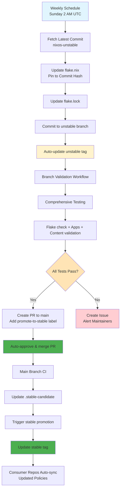

# Security & Governance

## Security Requirements

### Baseline Repository Best Practices

For production usage:

1. **Enable comprehensive CI validation** - primary security control
2. **Configure branch protection** with required status checks
3. **Use automation-friendly policies** - allow validated workflows to bypass PRs
4. **Enable CODEOWNERS** for human changes requiring review
5. **Use configuration-driven customization** - avoid hard-coding org values

See [SECURITY-BASELINE.md](../SECURITY-BASELINE.md) for detailed security guidelines and CI-first best practices.

---

## Supply Chain Security - Nixpkgs Updates

The baseline repository implements automated nixpkgs dependency updates with validation testing before promotion to stable. This follows the supply chain security best practices by pinning nixpkgs to specific commit hashes instead of branch references.

### Update Strategy

Lineage uses a three-stage strategy for managing both baseline changes and nixpkgs dependencies:

**unstable branch** - Primary development branch containing latest baseline changes and nixpkgs updates. Unstable tag automatically tracks this branch for immediate testing availability.

**main branch** - Production branch with validated changes. Automatically updated via auto-merge PRs when unstable branch validation passes.

**stable tag** - Production-ready version used by consumer repositories. Automatically updated when main branch CI completes successfully.

### Automated Update Pipeline

### Security Rationale

Pinning nixpkgs to explicit commit hashes provides better supply chain security:

**Auditability** - Commit hashes in flake.nix are immediately visible without checking flake.lock

**Intentional updates** - Changes require explicit commit modification, preventing accidental updates via `nix flake update`

**Compliance** - Aligns with SECURITY-BASELINE.md recommendations for critical trust points

**Traceability** - Clear git history of when and why nixpkgs was updated

---

## Baseline Promotion Workflow

The baseline repository implements a complete automation workflow that eliminates manual steps while maintaining validation and safety. The workflow supports development through an unstable branch with automatic promotion to main and stable tags.

### Complete Automation Process

The baseline uses a three-stage automated promotion system:

**unstable branch** - Main development branch where all commits are made. Unstable tag automatically tracks this branch for immediate testing availability.

**main branch** - Production branch containing validated changes. Automatically updated via auto-merge PRs when unstable branch validation passes.

**stable tag** - Production-ready baseline version used by consumer repositories. Automatically updated when main branch CI completes successfully.

### Validation Steps

Before creating a promotion PR, the system validates:

1. **Flake integrity** - `nix flake check` passes on multiple platforms
2. **App functionality** - All baseline apps build and run correctly
3. **Pack syntax** - All policy packs have valid Nix syntax
4. **Cross-platform** - Builds succeed on Linux and macOS
5. **Input validation** - New packs are scanned for security issues

---

## Stable Candidate Coordination

The baseline repository uses a `.stable-candidate` file to coordinate promotion from main branch to stable tag. This file acts as a temporary promotion signal in the complete automation pipeline.

### How .stable-candidate Works

**File Purpose:**
- Acts as a "promotion queue" marker for commits ready to be tagged as stable
- Contains the commit hash that baseline CI has validated and approved for stable promotion
- Serves as the handoff mechanism between baseline CI and the promote-to-stable workflow

**Lifecycle:**
1. **Creation**: Baseline CI creates/updates `.stable-candidate` when validation passes on main branch
2. **Content**: Contains the exact commit hash that passed validation: `a1b2c3d4e5f6...`
3. **Consumption**: Promote-to-stable workflow reads this file to know which commit to promote
4. **Removal**: File is deleted after successful promotion to stable tag
